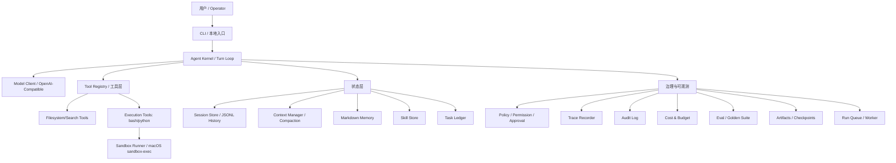

# 000-总览-Harness-分层架构与连载目录

## 中文版：先把地图摊开

我们要做的不是一堆工具函数，而是一个本地优先的 Agent Harness。费曼学习法的第一步，是把一个复杂系统讲到“初学者也能沿着线索复现”。所以这个系列不按代码文件写，而按 Harness 的分层职责写：模型之外，Agent 能行动、能记住、能治理、能复盘的部分，都逐步落成可运行模块。

### 整体分层架构图

### 当前实现状态表

| 层 | 模块 | 当前状态 | 已实现能力 |
|---|---|---:|---|
| 入口层 | CLI | 已实现 | run/tools/sessions/memory/skills/tasks/runs/trace/audit/eval/doctor/verify/init |
| 核心层 | Agent Kernel | 已实现 | turn loop、tool dispatch、session save、usage/cost、retry、fail-fast |
| 模型层 | Model Client | 已实现 | OpenAI-compatible、DeepSeek live 验证、tool call JSON 解析 |
| 工具层 | Filesystem/Search | 已实现 | read/write/append/edit/diff/move/copy/delete/list/grep |
| 工具层 | Execution | 已实现 | bash/python 经 sandbox runner 执行 |
| 安全层 | Sandbox Runner | 已实现 | macOS sandbox-exec、workspace write boundary、敏感路径拒读、fail closed |
| 状态层 | Session/Context | 已实现 | JSONL history、resume、compact、bundle import/export |
| 状态层 | Memory/Skills | 已实现 | Markdown memory、session extraction、skill registry/search/injection |
| 状态层 | Tasks/Runs | 已实现 | task ledger、run ledger、queue、worker、diagnose |
| 治理层 | Policy/Audit | 已实现 | permission mode、prompt approval、audit filter/summary |
| 可观测层 | Trace/Doctor | 已实现 | trace query/session summary、doctor JSON、sandbox probe |
| 评测层 | Eval/Golden/Verify | 已实现 | trace eval、golden suite、local verify、live smoke |
| 产物层 | Checkpoint/Artifacts | 已实现 | checkpoint/restore/diff、artifact register/verify |
| 服务层 | Harness Server | 未开始 | 后续在本地 harness 稳定后实现 |
| 交互层 | TUI/Channel/WebUI | 暂缓 | 不在当前阶段 |

### 文章编号规则

每个实现节点对应一篇文章。文件名和一级标题必须完全一致，格式为：

`NNN-层-模块-子模块.md`

每篇文章都要包含：

- 全局作用：这个模块在上图中的位置。
- 输入 / 输出 / 行为：可以被工程验证的接口。
- 过程记录：当时为什么做、测试怎么红、怎么变绿。
- 当前实现：代码、CLI、测试、验证方式。
- 未来扩展：留给 server、多 worker、UI 或更强治理的方向。

## English Version

This series documents the local-first harness from zero to one. Each article maps
one implementation step to the global layered architecture above, using a
Feynman-style explanation: why it exists, what it takes as input, what it
produces, how it behaves, how we verified it, and what should come next.

