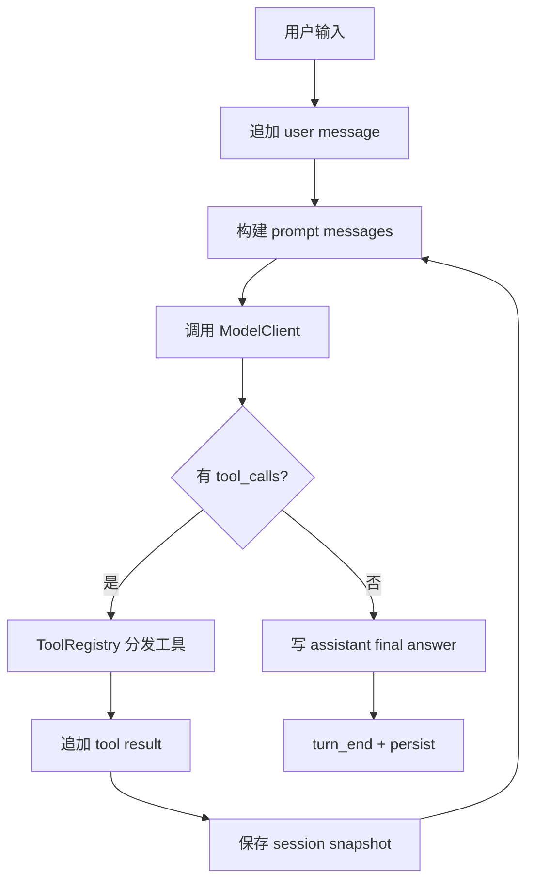

# 002-核心层-Kernel-Minimal Local Harness

## 中文版：让 Agent 跑完第一轮

### 全局作用

参见：[000-总览-Harness-分层架构与连载目录](000-总览-Harness-分层架构与连载目录.md)。本文位于核心层，是所有工具、状态和治理模块的挂载点。

对应整体架构图中的 Agent Kernel。Kernel 是 Harness 的心跳：接收用户输入，组装上下文，调用模型，执行工具，把结果写回 session。最小 harness 的目标不是强大，而是闭环：一轮对话必须能开始、推进、结束、落盘。

### 输入 / 输出 / 行为

- 输入：用户 prompt、模型配置、workspace。
- 输出：final answer、session 状态、工具结果。
- 行为：模型无 tool call 时直接结束；有 tool call 时执行工具并把结果送回模型。

### 实现原理与流程图

Kernel 采用模型驱动循环，而不是开发者预先写死流程图。每一轮先把系统 prompt、记忆/技能/任务上下文和 session 消息组装成 prompt messages；模型如果返回 final answer，turn 结束；如果返回 tool calls，Kernel 逐个执行工具，把 tool result 作为 tool message 追加回 session，再进入下一次模型调用。



### 过程记录

这一章把“Agent 不是 prompt flow，而是模型驱动循环”的思想落到代码里。我们没有先做复杂编排，而是先实现最小 turn loop，因为后续所有工具、状态、治理都挂在这条循环上。

### 当前实现

- 对应提交：`2964085 Implement local minimal harness`
- 当前状态：已实现
- 核心模块：`harness.kernel`、`harness.model`、`harness.tools`、`harness.session`
- 验证方式：CLI smoke 与 kernel tests。

### 测试例跑法

```bash
python3 -m pytest tests/test_kernel.py tests/test_cli_smoke.py::test_cli_run_with_mock_final_answer -q
PYTHONPATH=src python3 -m harness.cli run "say hi" --workspace /tmp/harness-ws --session-dir /tmp/harness-sessions --mock-final "hi" --json
```

读者验证点：第一条证明 kernel 行为；第二条证明 CLI 能驱动一次完整本地 turn，并输出 `session_id`、`turn_id` 和 `stop_reason`。

### 未来扩展计划

- 支持更细的 streaming event。
- 将 kernel 包装为 server API，但保持同一套本地实现。

## English Version

The minimal kernel closes the first loop: user input, model call, optional tool
dispatch, and persisted session state. It is the heartbeat that later layers
attach to.
