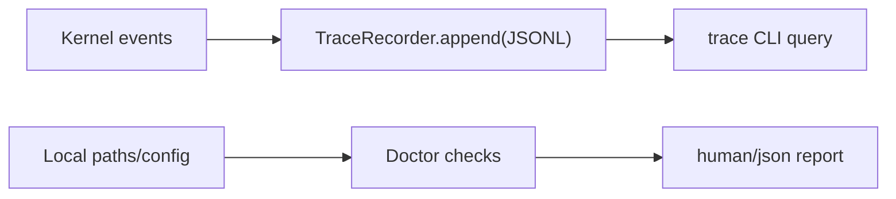

# 003-可观测层-TraceDoctor-CLI Diagnostics

## 中文版：系统要会说自己发生了什么

### 全局作用

参见：[000-总览-Harness-分层架构与连载目录](000-总览-Harness-分层架构与连载目录.md)。本文位于可观测层，负责让本地 harness 能解释自己。

对应整体架构图中的 Trace Recorder 和 Doctor。Agent 只要能行动，就一定会失败；失败不可怕，不知道为什么失败才可怕。Trace 记录运行轨迹，Doctor 检查本地环境是否准备好。

### 输入 / 输出 / 行为

- 输入：运行事件、本地目录配置。
- 输出：trace JSONL、doctor 检查结果。
- 行为：trace 追加事件；doctor 汇总 workspace、session、memory、tools 等健康状态。

### 实现原理与流程图

Trace 是运行中的“黑匣子记录仪”，每个关键事件以 JSONL 追加保存。Doctor 则是启动前或排障时的体检命令，它不执行 agent 任务，只检查目录、工具、模型配置和 sandbox runner 这类依赖是否可用。



### 过程记录

最早的 harness 如果只输出一句 final answer，调试会非常困难。所以第三步就补可观测性，让后续每个能力都有“证据链”。

### 当前实现

- 对应提交：`6d4950d Add trace and doctor CLI diagnostics`
- 当前状态：已实现
- 模块：`harness.trace`、`harness.doctor`
- CLI：`harness trace`、`harness doctor`

### 测试例跑法

```bash
python3 -m pytest tests/test_trace_cli.py::test_cli_trace_and_doctor_commands -q
PYTHONPATH=src python3 -m harness.cli doctor --json
```

读者验证点：测试覆盖 trace 与 doctor 的 CLI；doctor JSON 可以直接作为未来 server/UI 的诊断输入。

### 未来扩展计划

- Trace 事件 schema versioning。
- Doctor 输出面向 server UI 的结构化诊断建议。

## English Version

Trace and doctor commands make the harness explain itself. Trace records what
happened; doctor checks whether the local environment is ready.
