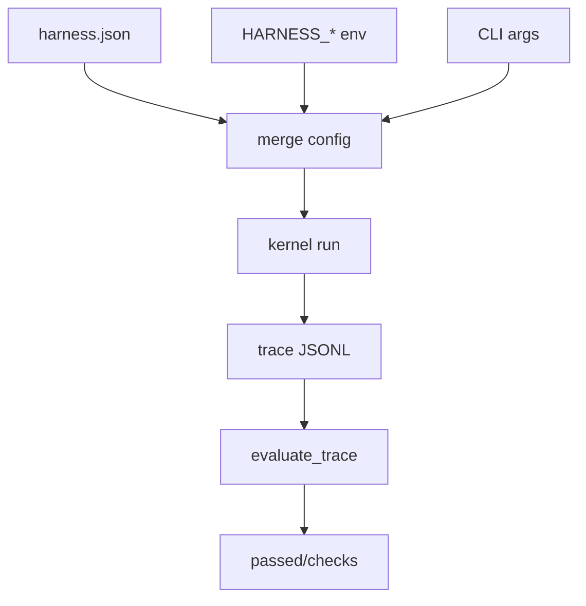

# 004-治理层-ConfigEval-Failure Handling

## 中文版：把配置、评测和失败变成工程对象

### 全局作用

参见：[000-总览-Harness-分层架构与连载目录](000-总览-Harness-分层架构与连载目录.md)。本文位于治理层与评测层，解决“配置可复现、结果可判断、失败可解释”。

对应整体架构图中的 Config、Eval 和 Failure Handling。Harness 不能只靠命令行参数散跑；它需要可复用配置、可判断结果的评测入口，以及把失败变成明确状态。

### 输入 / 输出 / 行为

- 输入：JSON config、trace、期望条件。
- 输出：合并后的运行配置、eval report、失败 stop reason。
- 行为：配置驱动运行；eval 判断 stop reason、工具错误等条件；失败不会伪装成成功。

### 实现原理与流程图

配置层把 CLI 参数、环境变量和 JSON 文件合并成统一 `HarnessConfig`。Eval 不重新运行任务，而是读取 trace 结果，根据期望条件判断是否通过。失败处理则把异常路径转成明确 `stop_reason`，让上层 run/task/worker 能继续治理。



### 过程记录

这一步让 harness 从 demo 进入“可以反复验证”的阶段。配置让环境可复现，eval 让行为可判定，failure handling 让失败变成系统状态而不是异常噪音。

### 当前实现

- 对应提交：`bdfecb3 Add config eval and failure handling`
- 当前状态：已实现
- 模块：`harness.config`、`harness.eval`

### 测试例跑法

```bash
python3 -m pytest tests/test_config.py tests/test_replay_eval.py -q
PYTHONPATH=src python3 -m harness.cli config --validate --json
```

读者验证点：配置校验能发现非法参数；eval 测试证明 trace 可以被机器判定。

### 未来扩展计划

- 多 profile config。
- Eval case 与 specs 自动关联。

## English Version

Configuration, evaluation, and failure states turn ad-hoc runs into repeatable
engineering workflows.
