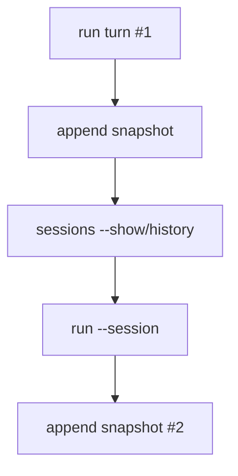

# 005-状态层-Session-Resume Inspection

## 中文版：让会话不是一次性消耗品

### 全局作用

参见：[000-总览-Harness-分层架构与连载目录](000-总览-Harness-分层架构与连载目录.md)。本文位于状态层的 Session 分支。

对应整体架构图中的 Session Store。长程任务一定跨 turn，甚至跨进程。Session resume inspection 让本地 harness 能查看和复用已有 session，而不是每次都从空白上下文开始。

### 输入 / 输出 / 行为

- 输入：`session_id`、session 目录。
- 输出：session 摘要、消息数量、最后消息。
- 行为：CLI 可以加载已有 session 并继续写入。

### 实现原理与流程图

Session 以 JSONL 快照形式保存，每次保存追加一行最新状态。这样既能快速加载最后状态，也能保留历史快照用于调试。Resume 的本质是通过 `session_id` 重新加载最后一条 snapshot，再把新 turn 追加到同一条会话轨迹上。



### 过程记录

实现 resume 的第一步不是复杂压缩，而是能看见 session。只有可查看，才知道能不能恢复；只有能恢复，后面 queue、handoff、memory 才有意义。

### 当前实现

- 对应提交：`a91ef75 Add session resume inspection`
- 当前状态：已实现
- 模块：`harness.session`
- CLI：`harness sessions --show`、`run --session`

### 测试例跑法

```bash
python3 -m pytest tests/test_session_context.py tests/test_cli_smoke.py::test_cli_can_resume_existing_session -q
```

读者验证点：测试会创建 session、续写 session，并检查消息数量增长。

### 未来扩展计划

- 基于 session 的 fork/branch。
- 更强的 resume 选择器，例如按 workspace、task、时间筛选。

## English Version

Session inspection and resume make conversations durable. A local harness should
be able to inspect, load, and continue an existing session.
