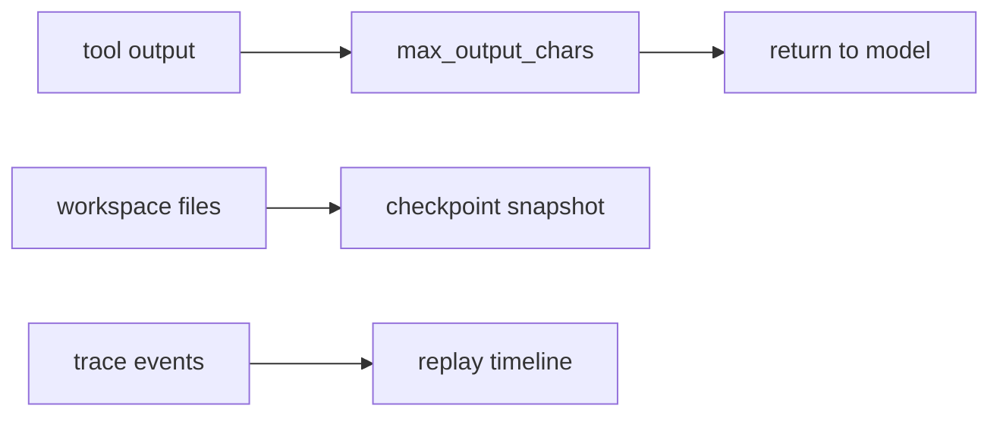

# 006-可观测层-ReplayCheckpoint-Output Limits

## 中文版：能回放，也要能刹车

### 全局作用

参见：[000-总览-Harness-分层架构与连载目录](000-总览-Harness-分层架构与连载目录.md)。本文横跨可观测层、产物层和工具安全边界。

对应整体架构图中的 Replay、Checkpoint 和输出控制。Agent 会产生大量文本和文件变化；Harness 需要能回看发生过什么，也需要限制输出，避免上下文被工具结果淹没。

### 输入 / 输出 / 行为

- 输入：trace、workspace、工具输出。
- 输出：replay timeline、checkpoint、截断后的 tool result。
- 行为：回放关键事件；在风险操作前保存状态；长输出按限制截断。

### 实现原理与流程图

Replay 从 trace 中把事件还原成紧凑时间线；Checkpoint 在 workspace 层保存文件快照；输出限制则发生在 ToolResult 返回模型前。三者配合，形成“看得见、退得回、塞不爆上下文”的基础保护。



### 过程记录

这一章补的是“操作安全感”。当 Agent 开始改文件，开发者需要知道它改了什么、能不能回退、输出会不会爆上下文。

### 当前实现

- 对应提交：`8c223cb Add replay checkpoint and output limits`
- 当前状态：已实现
- 模块：`harness.checkpoint`、`harness.trace`、`harness.tools`

### 测试例跑法

```bash
python3 -m pytest tests/test_checkpoint.py tests/test_replay_eval.py tests/test_tools_workspace.py::test_tool_output_is_truncated -q
```

读者验证点：checkpoint 可创建/恢复，replay 可读 trace，工具输出会被截断。

### 未来扩展计划

- checkpoint 增量化。
- replay 生成更适合人读的任务故事线。

## English Version

Replay, checkpoints, and output limits make local agent actions inspectable,
recoverable, and context-safe.
