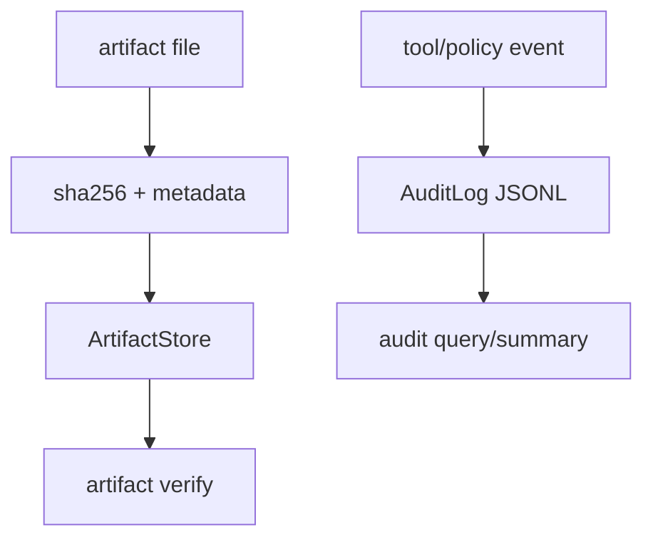

# 007-治理层-ArtifactsAudit-Logging

## 中文版：产物和行为都要留下账本

### 全局作用

参见：[000-总览-Harness-分层架构与连载目录](000-总览-Harness-分层架构与连载目录.md)。本文位于治理层和产物层。

对应整体架构图中的 Artifacts 和 Audit。Trace 记录“发生了什么”，Audit 更关心“谁被允许做了什么”，Artifacts 则把重要文件产物登记成可验证对象。

### 输入 / 输出 / 行为

- 输入：工具调用、审批决策、产物路径。
- 输出：audit JSONL、artifact metadata。
- 行为：记录 tool call、approval、文件 hash、产物校验状态。

### 实现原理与流程图

Audit 采用追加式 JSONL，记录 action、allowed、session/turn 等上下文；ArtifactStore 为文件产物计算 hash，并保存 kind、relative path、size 等元数据。一个偏治理，一个偏产物，两者共同构成未来 server 的可追溯底座。



### 过程记录

当 Harness 进入可执行阶段，治理不能晚到。任何文件改动、危险工具、重要产物都应该有账本，这也是未来 server 多用户权限的前置条件。

### 当前实现

- 对应提交：`68e6d58 Add artifacts and audit logging`
- 当前状态：已实现
- 模块：`harness.audit`、`harness.artifacts`

### 测试例跑法

```bash
python3 -m pytest tests/test_artifacts_audit.py -q
```

读者验证点：artifact 可以注册/校验；audit 可以按 session、turn、action 和 allowed 过滤。

### 未来扩展计划

- artifact provenance graph。
- audit 与用户/角色权限系统打通。

## English Version

Artifacts and audit logs create accountability: what was produced, who was
allowed to do what, and whether outputs still verify.
