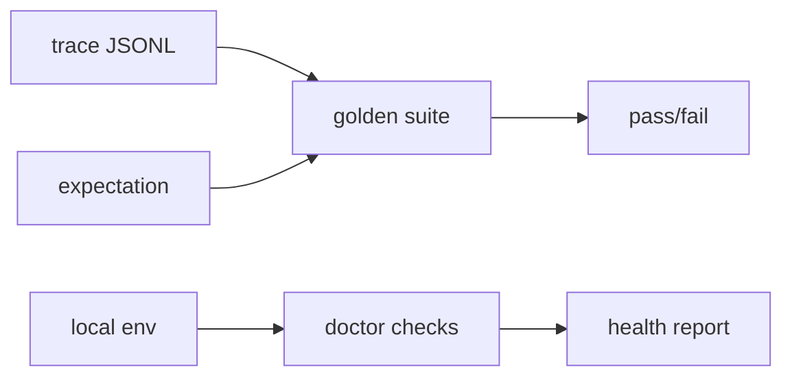

# 008-评测层-GoldenRegression-Doctor Checks

## 中文版：把一次成功变成以后都能守住的回归线

### 全局作用

参见：[000-总览-Harness-分层架构与连载目录](000-总览-Harness-分层架构与连载目录.md)。本文位于评测层。

对应整体架构图中的 Eval、Golden Suite 和 Doctor。一次跑通不等于系统可靠；可靠来自把成功路径固化成回归测试，把环境依赖固化成健康检查。

### 输入 / 输出 / 行为

- 输入：trace、golden expectation、本地环境。
- 输出：golden report、doctor report。
- 行为：根据 trace 判断 stop reason、工具调用、错误数；doctor 检查本地目录和工具注册。

### 实现原理与流程图

Golden regression 把 trace 文件和 expectation 绑定起来：不重新发起模型调用，只验证已有轨迹是否满足要求。Doctor checks 则验证运行环境。这两个命令一个看“行为是否符合预期”，一个看“环境是否准备好”。



### 过程记录

这一步把“我刚刚试过能跑”变成“以后每次都能证明没坏”。对 Harness 这种多模块系统，golden regression 是防止迭代把旧能力打碎的底线。

### 当前实现

- 对应提交：`d184e8c Add golden regression and doctor checks`
- 当前状态：已实现
- 模块：`harness.eval`、`harness.doctor`

### 测试例跑法

```bash
python3 -m pytest tests/test_replay_eval.py tests/test_regression_doctor.py -q
```

读者验证点：golden 能判定 trace，doctor 能报告本地 harness 依赖状态。

### 未来扩展计划

- golden case 自动从成功 run 里提炼。
- doctor 提供修复建议而不仅是状态。

## English Version

Golden regression turns one successful run into a reusable safety line for
future changes.
