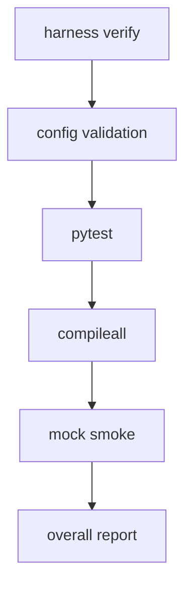

# 009-评测层-Verify-Local Verification Runner

## 中文版：一条命令跑完本地闸门

### 全局作用

参见：[000-总览-Harness-分层架构与连载目录](000-总览-Harness-分层架构与连载目录.md)。本文位于评测层，是本地交付闸门。

对应整体架构图中的 Verify。随着模块增多，手动记测试命令会越来越不可靠。`verify` 把 config validation、pytest、compile、smoke test 收到一条命令里，成为本地 harness 的总闸门。

### 输入 / 输出 / 行为

- 输入：work dir、verify options。
- 输出：每个 gate 的 pass/fail 和 overall。
- 行为：顺序运行配置校验、测试、编译、mock smoke；后续支持 live smoke。

### 实现原理与流程图

Verify 是一个 gate runner。它把多个独立检查组织成固定顺序，并把每个检查的结果汇总成 report。这样读者和维护者不需要记住所有命令，只要跑 `harness verify` 就能知道当前本地 harness 是否健康。



### 过程记录

这是从“会写代码”到“会交付”的一步。每次改动后，我们都希望能用同一条命令回答：这个本地 harness 还健康吗？

### 当前实现

- 对应提交：`f5ad945 Add local verification runner`
- 当前状态：已实现
- 模块：`harness.verify`
- CLI：`harness verify`

### 测试例跑法

```bash
python3 -m pytest tests/test_verify.py -q
PYTHONPATH=src python3 -m harness.cli verify --work-dir /tmp/harness-verify-demo
```

读者验证点：第一条验证 verify 模块；第二条实际跑完整本地 gate。

### 未来扩展计划

- 增加分层 verify profile。
- 将 specs 覆盖率纳入 verify。

## English Version

`verify` collects local gates into one command: config validation, tests,
compile checks, and smoke runs.
