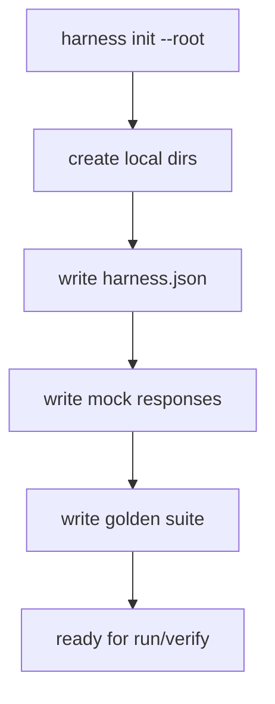

# 010-入口层-Init-Local Harness Scaffold Command

## 中文版：让别人也能一键起步

### 全局作用

参见：[000-总览-Harness-分层架构与连载目录](000-总览-Harness-分层架构与连载目录.md)。本文位于入口层的 Bootstrap 分支。

对应整体架构图中的 CLI / Bootstrap。一个 Harness 不能只在作者机器上跑；`init` 命令把配置、workspace、samples、golden suite 初始化出来，让新目录能快速进入可验证状态。

### 输入 / 输出 / 行为

- 输入：目标 root。
- 输出：harness config、workspace、sessions、memory、skills、tasks、runs、artifacts、samples。
- 行为：生成可运行 mock scenario，并配套 golden 验证。

### 实现原理与流程图

`init` 是把“如何搭一个本地 harness”固化成命令。它创建目录、写 config、放入 sample responses，并生成可跑的 golden suite。这样教程读者可以从同一个起点复现后续章节，而不是在环境准备上迷路。



### 过程记录

这一章解决的是“复现门槛”。如果一个系统每次都要手工配目录和 fixture，学习者很难跟上。`init` 把第一公里铺平。

### 当前实现

- 对应提交：`f991fef Add local harness scaffold command`
- 当前状态：已实现
- 模块：`harness.scaffold`
- CLI：`harness init`

### 测试例跑法

```bash
python3 -m pytest tests/test_init_scaffold.py -q
PYTHONPATH=src python3 -m harness.cli init --root /tmp/harness-init-demo --overwrite
```

读者验证点：init 会生成 config、samples 和 golden 文件；生成目录可继续跑 README 中的 smoke。

### 未来扩展计划

- 生成不同 profile 的模板：research、coding、ops。
- init 后自动运行 doctor 和 verify。

## English Version

`init` creates a runnable local harness layout with config, sample responses, and
a golden suite so new users can start from a verified baseline.
