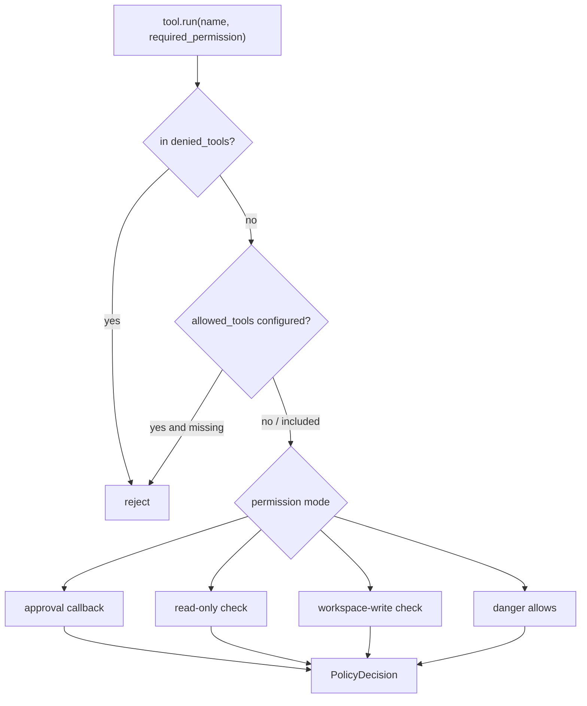

# 011-治理层-Policy-Tool Governance

## 中文版：先给工具套上规矩

### 全局作用

参见：[000-总览-Harness-分层架构与连载目录](000-总览-Harness-分层架构与连载目录.md)。本文位于治理层的 Policy 分支，连接 Agent Kernel 和 Tool Registry。

Agent Harness 不是把所有工具一股脑交给模型。模型越能行动，权限边界就越重要。Tool Governance 的作用是把工具调用先过一遍策略：当前模式能不能写文件，能不能执行命令，是否命中 allowlist / denylist，是否需要人工确认。

### 输入 / 输出 / 行为

- 输入：工具名、工具所需权限、当前 `PermissionMode`、allowlist、denylist、可选 approval callback。
- 输出：`PolicyDecision`，包含 `allowed` 和拒绝原因。
- 行为：
  - denylist 优先级最高。
  - allowlist 存在时，未列入工具直接拒绝。
  - `read-only` 只能读。
  - `workspace-write` 可以写 workspace，但不能执行危险工具。
  - `danger` 放行高风险工具。
  - `prompt` 通过 callback 做人工确认。

### 实现原理与流程图

Policy 是工具层前的一道窄门。工具自身声明 `required_permission`，Policy 不关心工具内部怎么实现，只判断“这次调用在当前治理模式下是否允许”。这个设计让权限逻辑集中在一处，而不是散落在每个工具 handler 里。



### 过程记录

这一节点把“工具能不能用”从工具实现里抽出来。我们先验证 prompt approval、denylist 优先、allowlist 收窄，再让工具调用统一依赖 Policy。这样后续加 `bash`、`python`、browser 这类高风险工具时，不需要重写治理逻辑。

### 当前实现

| 项 | 状态 |
|---|---|
| 层 | 治理层 |
| 模块 | Policy |
| 子模块 | Tool Governance |
| 实现状态 | 已实现 |
| 对应提交 | `1b63913 Add tool governance policies` |

- 模块：`harness.permissions.Policy`
- 接入点：`harness.tools.Tool.run`
- CLI：`--permission`、`--allow-tool`、`--deny-tool`

### 测试例跑法

```bash
python3 -m pytest tests/test_approval.py -q
PYTHONPATH=src python3 -m harness.cli tools --show bash
```

读者验证点：第一条证明策略优先级和 prompt approval；第二条查看工具声明的 required permission。

### 未来扩展计划

- 增加角色权限，例如 researcher/coder/tester。
- 给 allow/deny policy 增加 pattern 规则。
- 把审批迁移到 server/channel，但本地 Policy 保持同一接口。

## English Version

Tool governance is the permission gate between the kernel and tools. It checks
deny rules, allow rules, permission mode, and optional approval callbacks before
any tool handler runs.

