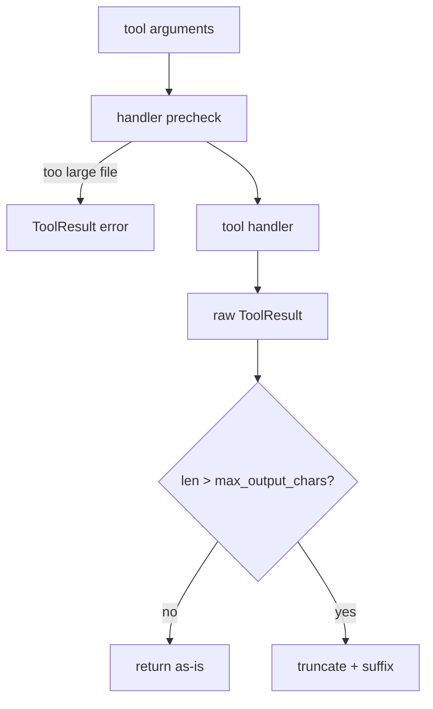

# 012-工具层-Resources-Tool Resource Limits

## 中文版：工具输出不能把上下文撑爆

### 全局作用

参见：[000-总览-Harness-分层架构与连载目录](000-总览-Harness-分层架构与连载目录.md)。本文位于工具层的 Resource Limits 分支。

工具能读文件、跑命令、搜索目录，也就意味着它可能一次返回几 MB 文本。对 Agent 来说，过大的工具输出会污染上下文、浪费 token，甚至让后续模型调用失败。资源限制就是给工具结果加上护栏。

### 输入 / 输出 / 行为

- 输入：工具结果、`max_output_chars`、`max_file_read_bytes`。
- 输出：原始结果或带 `[truncated ... chars]` 的截断结果。
- 行为：
  - 所有工具输出统一经过 `Tool._limit`。
  - `read_file` 对大文件做字节上限保护。
  - 范围读取可以绕开整文件读取限制，只读指定行。

### 实现原理与流程图

资源限制分两层：第一层在 handler 前，例如 `read_file` 根据文件大小决定是否拒绝；第二层在 handler 后，所有 `ToolResult` 都通过统一截断器。这让单个工具可以有自己的安全判断，同时全局还有最后一道输出闸门。



### 过程记录

这一步解决的是“工具可用之后的副作用”。最早的工具如果无限制返回，很快会把上下文窗口吃满。我们先在工具注册表里加入运行时限制，再用测试证明长输出会截断，大文件读取会被拒绝。

### 当前实现

| 项 | 状态 |
|---|---|
| 层 | 工具层 |
| 模块 | Resources |
| 子模块 | Tool Resource Limits |
| 实现状态 | 已实现 |
| 对应提交 | `210f6f6 Add tool resource limits` |

- 模块：`harness.tools.ToolRuntimeLimits`
- 接入点：`default_tool_registry(max_output_chars=..., max_file_read_bytes=...)`
- 配置：`HarnessConfig.max_output_chars`、`HarnessConfig.max_file_read_bytes`

### 测试例跑法

```bash
python3 -m pytest tests/test_tools_workspace.py::test_tool_output_is_truncated tests/test_tools_workspace.py::test_read_file_refuses_large_files_by_default -q
PYTHONPATH=src python3 -m harness.cli config --show
```

读者验证点：工具长输出会被截断；超大文件读取会被挡住；配置里可以看到限制项。

### 未来扩展计划

- 按工具分别配置输出上限。
- 对 shell/python 输出做 stdout/stderr 分段摘要。
- 引入 token-aware truncation，而不只是字符数。

## English Version

Tool resource limits protect the model context from huge files and noisy command
outputs by checking file size before reads and truncating all tool results after
execution.

