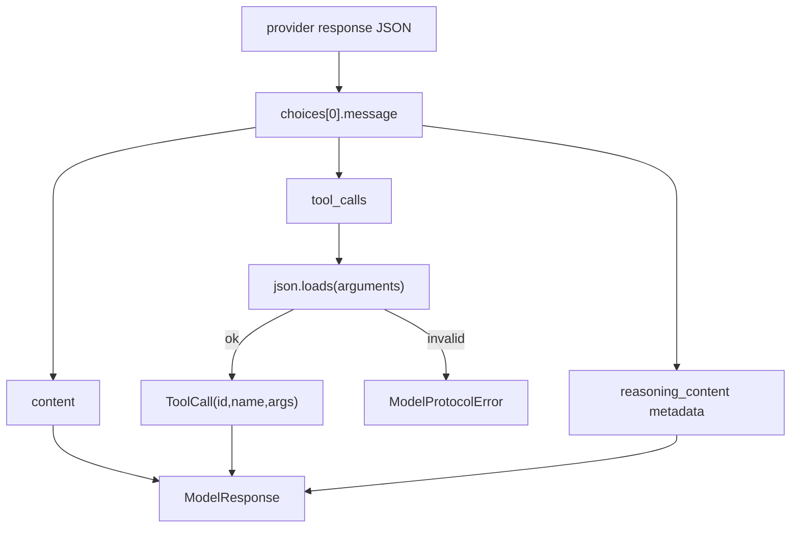

# 013-模型层-Model-Parsing Usage Tracking

## 中文版：模型返回不能随便信

### 全局作用

参见：[000-总览-Harness-分层架构与连载目录](000-总览-Harness-分层架构与连载目录.md)。本文位于模型层，负责 OpenAI-compatible response parsing 和 usage tracking。

Agent Kernel 依赖模型返回 tool calls。如果模型返回的 tool arguments 不是合法 JSON，或者 usage 字段在不同供应商里名字不一致，Kernel 就会失去可预测性。模型层要把供应商差异和协议错误都收口。

### 输入 / 输出 / 行为

- 输入：OpenAI-compatible chat completion response。
- 输出：`ModelResponse(content, tool_calls, usage, metadata)`。
- 行为：
  - 解析 `tool_calls[].function.arguments` 为 dict。
  - 非 JSON arguments 抛出 `ModelProtocolError`。
  - 缺失 call id 时生成本地 id。
  - 保留 DeepSeek 等模型的 `reasoning_content` metadata。

### 实现原理与流程图

模型层把网络返回转换成 Harness 内部 schema。Kernel 后续只依赖 `ModelResponse`，不直接读 provider 原始 JSON。这样一旦供应商字段变化，只需要收敛在 `OpenAICompatibleModelClient`。



### 过程记录

这一节点不是追求更多模型能力，而是让模型输出可信。我们补了 invalid JSON、缺失 tool_call id、reasoning_content round-trip 等测试，确保 Kernel 不被不规范模型返回拖垮。

### 当前实现

| 项 | 状态 |
|---|---|
| 层 | 模型层 |
| 模块 | Model Client |
| 子模块 | Parsing Usage Tracking |
| 实现状态 | 已实现 |
| 对应提交 | `1626cb9 Harden model parsing and usage tracking` |

- 模块：`harness.model.OpenAICompatibleModelClient`
- Schema：`harness.schema.ModelResponse`、`ToolCall`
- 错误：`ModelProtocolError`

### 测试例跑法

```bash
python3 -m pytest tests/test_model_client.py -q
```

读者验证点：工具参数 JSON 解析、缺失 call id、reasoning metadata 都有覆盖。

### 未来扩展计划

- 支持 streaming parser。
- 给不同 provider 增加 adapter 层。
- 把 protocol error 写入 trace，方便线上诊断。

## English Version

The model layer normalizes OpenAI-compatible responses into internal
`ModelResponse` objects and rejects malformed tool arguments before they reach
the kernel.

