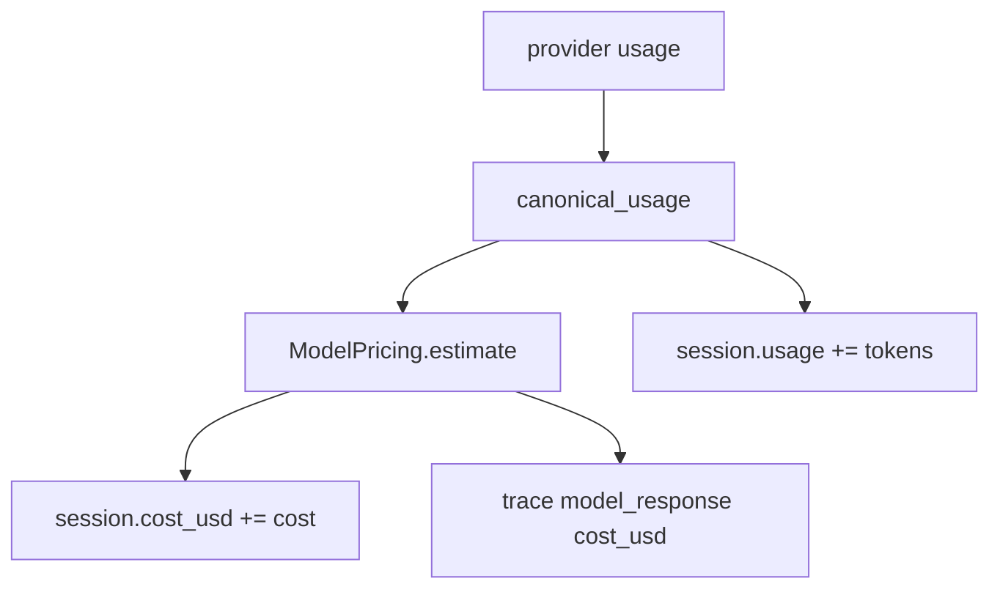

# 014-治理层-Cost-Budget Checks

## 中文版：Token 也要记账

### 全局作用

参见：[000-总览-Harness-分层架构与连载目录](000-总览-Harness-分层架构与连载目录.md)。本文位于治理层的 Cost 分支。

Harness 不只是让 Agent 完成任务，也要知道任务花了多少。Token usage 和 cost 是长程 Agent 的基础运营指标：没有成本账本，就不知道某个工具、记忆、上下文策略是否值得。

### 输入 / 输出 / 行为

- 输入：模型返回的 usage 字段、模型单价配置。
- 输出：规范化 token 统计、估算成本。
- 行为：
  - 接受 `prompt_tokens/completion_tokens`。
  - 兼容 `input_tokens/output_tokens` 这类 provider alias。
  - 根据百万 token 单价估算 cost。

### 实现原理与流程图

Cost 模块先把 usage 字段统一成 canonical form，再用 pricing 计算成本。Kernel 每次模型响应后把 usage 累加到 session，同时把本次 cost 写入 trace。



### 过程记录

这一步让“模型调用”从黑盒变成可计量对象。先有 usage/cost，后面才能做 budget enforcement、成本评测和不同 harness 策略对比。

### 当前实现

| 项 | 状态 |
|---|---|
| 层 | 治理层 |
| 模块 | Cost |
| 子模块 | Budget Checks |
| 实现状态 | 已实现 |
| 对应提交 | `11d3a93 Add cost tracking and budget checks` |

- 模块：`harness.cost`
- Kernel 接入：`AgentKernel._record_usage`

### 测试例跑法

```bash
python3 -m pytest tests/test_cost.py tests/test_kernel.py::test_kernel_accumulates_usage_and_cost -q
```

读者验证点：usage alias 会被规范化；模型 cost 会累加到 session 并进入 trace。

### 未来扩展计划

- 按模型名称加载价格表。
- 输出每个 turn / tool loop 的成本分解。
- 在 eval 中对成本效率做回归约束。

## English Version

Cost tracking normalizes provider usage fields and estimates model cost so the
harness can reason about long-running agent economics.

