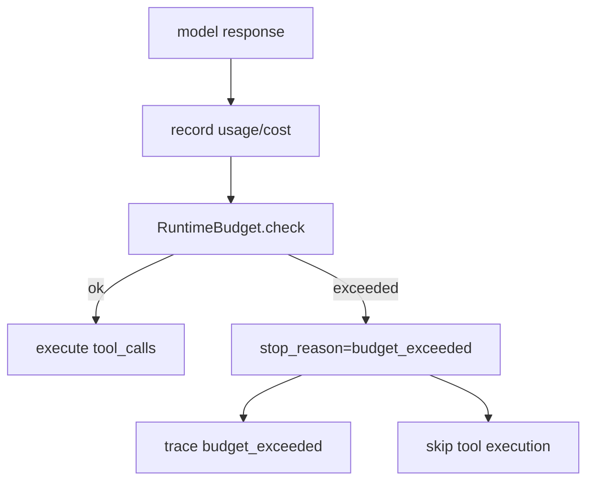

# 015-治理层-Budget-Runtime Enforcement

## 中文版：超预算就别再动手

### 全局作用

参见：[000-总览-Harness-分层架构与连载目录](000-总览-Harness-分层架构与连载目录.md)。本文位于治理层的 Budget 分支。

知道成本还不够，Harness 还要能在超预算时停下来。特别是模型已经返回 tool calls 但 usage 超限时，如果继续执行写文件或 shell 命令，就会把“已经失控的调用”扩展成真实副作用。

### 输入 / 输出 / 行为

- 输入：累计 total tokens、累计 cost、runtime budget。
- 输出：`budget_exceeded` stop reason 或继续执行。
- 行为：
  - 每次模型响应后检查 budget。
  - 超限时追加 assistant message，停止 turn。
  - 超限后不再执行工具调用。

### 实现原理与流程图

Budget enforcement 放在模型响应之后、工具执行之前。这个位置很关键：只有拿到 usage 后才知道是否超限；只有在工具前检查，才能防止副作用继续发生。



### 过程记录

我们用一个模型返回 `write_file` 但 usage 超限的测试证明：Kernel 必须停止，并且 workspace 里不能出现目标文件。这条测试把预算治理和副作用控制绑在一起。

### 当前实现

| 项 | 状态 |
|---|---|
| 层 | 治理层 |
| 模块 | Budget |
| 子模块 | Runtime Enforcement |
| 实现状态 | 已实现 |
| 对应提交 | `8812c90 Enforce runtime token and cost budgets` |

- 模块：`harness.cost.RuntimeBudget`
- Kernel 接入：`AgentKernel.run_turn`
- Config：`max_total_tokens`、`max_cost_usd`

### 测试例跑法

```bash
python3 -m pytest tests/test_kernel.py::test_kernel_stops_before_tools_when_runtime_budget_is_exceeded tests/test_cost.py::test_runtime_budget_reports_exceeded_limits -q
```

读者验证点：预算超限会阻止工具执行，并写入 trace。

### 未来扩展计划

- 支持 per-task / per-user budget。
- 增加预算接近阈值的 warning event。
- 在 server 中展示 budget burn-down。

## English Version

Runtime budget enforcement checks token and cost limits after model responses
and before tool execution, preventing over-budget calls from causing side
effects.

