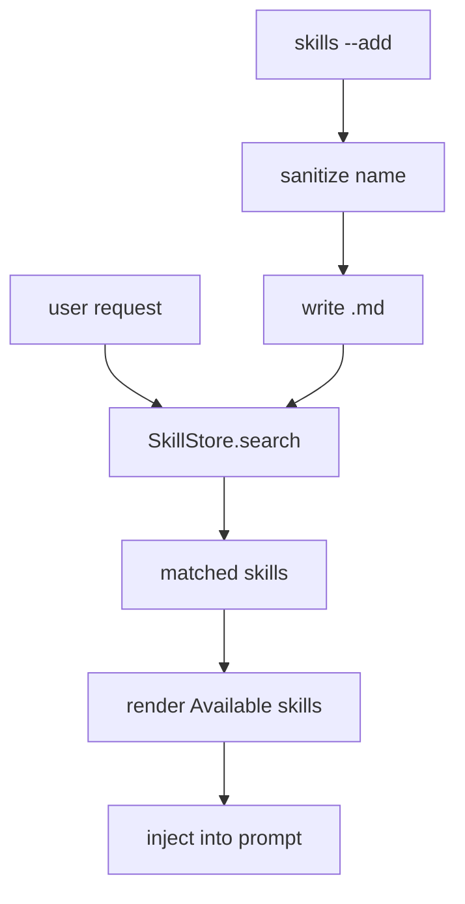

# 016-状态层-Skills-Local Skill Registry

## 中文版：把可复用经验写成 Skill

### 全局作用

参见：[000-总览-Harness-分层架构与连载目录](000-总览-Harness-分层架构与连载目录.md)。本文位于状态层的 Skills 分支。

Skill 和 Memory 都是上下文资产，但边界略有不同：Memory 更像事实和偏好，Skill 更像可复用 SOP。Local Skill Registry 让本地 harness 可以把调试套路、代码约定、工具使用方法写成 Markdown，并在相关请求中注入给模型。

### 输入 / 输出 / 行为

- 输入：skill 名称、description、body、查询文本。
- 输出：Markdown skill 文件、匹配后的 skill context。
- 行为：
  - skill 文件名会被 sanitize。
  - search 根据 name/description/body 匹配。
  - render_context 在相关时生成 `Available skills`。
  - 支持 get/delete/list。

### 实现原理与流程图

SkillStore 用文件系统做最小数据库：一个 skill 一个 Markdown 文件。写入时清洗名字，读取时解析 description 和 body，渲染时只把相关 skill 注入上下文，避免所有 SOP 一次性塞进 prompt。



### 过程记录

这一节点把“经验复用”从口头约定变成文件化资产。测试覆盖添加、搜索、渲染、名字清洗、删除和并发写入，为后续自动生成 skill 打基础。

### 当前实现

| 项 | 状态 |
|---|---|
| 层 | 状态层 |
| 模块 | Skills |
| 子模块 | Local Skill Registry |
| 实现状态 | 已实现 |
| 对应提交 | `9eed998 Add local skill registry` |

- 模块：`harness.skills.SkillStore`
- CLI：`harness skills`
- Kernel 接入：相关 skill context 注入 prompt

### 测试例跑法

```bash
python3 -m pytest tests/test_skills.py tests/test_kernel.py::test_kernel_injects_relevant_skill_context -q
PYTHONPATH=src python3 -m harness.cli skills --skill-dir /tmp/harness-skills --add pytest-debug --description "Debug Python tests" --body "Use pytest -q."
```

读者验证点：skill 能写入、搜索、渲染，并被 Kernel 注入。

### 未来扩展计划

- 从 trace/memory 自动建议 skill。
- 支持 skill version 和来源。
- 增加 skill 权限，避免跨 workspace 泄露。

## English Version

The local skill registry stores reusable procedures as Markdown files and injects
relevant skills into the kernel prompt when the user request matches them.

