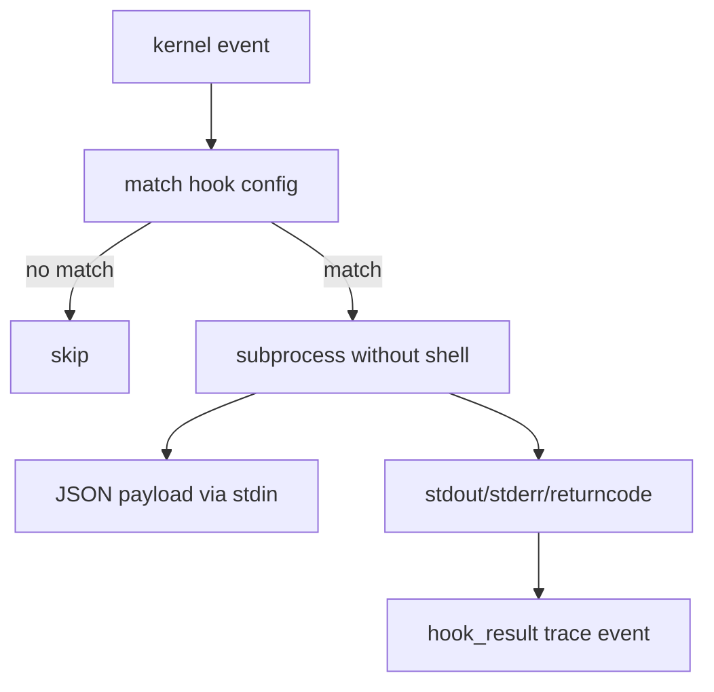

# 017-执行层-Hooks-Local Lifecycle Hooks

## 中文版：给生命周期留出插槽

### 全局作用

参见：[000-总览-Harness-分层架构与连载目录](000-总览-Harness-分层架构与连载目录.md)。本文位于执行层的 Hooks 分支。

Hook 是 Harness 的扩展插槽。Kernel 不应该把所有副作用都写死，比如 turn_end 后通知、导出、索引、触发记忆整理，都可以先通过本地 hook 命令实现。

### 输入 / 输出 / 行为

- 输入：hook config、event name、event payload。
- 输出：hook result trace event。
- 行为：
  - 只执行 event 匹配的 hook。
  - hook 命令不通过 shell，参数数组执行。
  - event payload 通过 stdin 传入。
  - hook stdout/stderr/returncode 会被记录。

### 实现原理与流程图

HookRunner 是一个小型事件分发器。Kernel 在 `turn_start`、`tool_call`、`turn_end` 等节点发出事件；HookRunner 根据配置选择命令，把 payload 作为 JSON stdin 传给子进程，再把结果写回 trace。



### 过程记录

这一节点的重点是扩展性，但保持安全克制：不用 shell，避免字符串命令注入；hook 失败不阻断 turn，而是进入 trace，方便后续诊断。

### 当前实现

| 项 | 状态 |
|---|---|
| 层 | 执行层 |
| 模块 | Hooks |
| 子模块 | Local Lifecycle Hooks |
| 实现状态 | 已实现 |
| 对应提交 | `171894c Add local lifecycle hooks` |

- 模块：`harness.hooks.HookRunner`
- Config：`hook_config`
- Kernel 接入：`AgentKernel._run_hooks`

### 测试例跑法

```bash
python3 -m pytest tests/test_hooks.py -q
```

读者验证点：hook 能接收 event JSON stdin；不匹配 event 不执行。

### 未来扩展计划

- 增加内置 hook 类型，例如 memory extraction、artifact indexing。
- server 模式下把 hook result 推送到事件总线。
- 支持 hook timeout/retry policy 的细粒度配置。

## English Version

Lifecycle hooks provide local extension points around kernel events. Commands
receive event JSON on stdin and their results are recorded instead of silently
disappearing.

