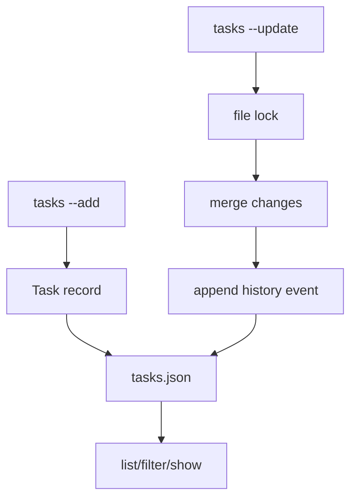

# 018-状态层-Tasks-Local Task Ledger

## 中文版：长任务要有任务账本

### 全局作用

参见：[000-总览-Harness-分层架构与连载目录](000-总览-Harness-分层架构与连载目录.md)。本文位于状态层的 Tasks 分支。

Session 记录对话，Task 记录目标。一个长程任务可能跨多个 session、多个 run、多个上下文窗口。Task Ledger 给这些运行提供一个稳定锚点：标题、描述、状态、关联 session、metadata 和 history。

### 输入 / 输出 / 行为

- 输入：task title、description、status、session_id、metadata。
- 输出：`tasks.json` 中的 task record。
- 行为：
  - create/update/list/show/delete。
  - 支持按 status 和 session 过滤。
  - 每次 create/update 写入 history。
  - 并发更新通过文件锁串行化。

### 实现原理与流程图

TaskStore 使用一个 JSON 文件保存任务表，并用 lock 保护读写。每次 update 只记录变化字段到 history，这样既能读取当前状态，也能回看状态演化。



### 过程记录

这一节点把“我正在做什么”从 prompt 文本里抽出来，变成可查询状态。后面 active task context、run auto-update、handoff 都依赖这张任务账本。

### 当前实现

| 项 | 状态 |
|---|---|
| 层 | 状态层 |
| 模块 | Tasks |
| 子模块 | Local Task Ledger |
| 实现状态 | 已实现 |
| 对应提交 | `dcc2add Add local task ledger` |

- 模块：`harness.tasks.TaskStore`
- CLI：`harness tasks`
- 状态：todo / in_progress / done / blocked

### 测试例跑法

```bash
python3 -m pytest tests/test_tasks.py -q
PYTHONPATH=src python3 -m harness.cli tasks --task-dir /tmp/harness-tasks --add "ship local harness"
```

读者验证点：task 能创建、更新、过滤、保存 history，并支持并发更新。

### 未来扩展计划

- task dependency graph。
- task 与 run queue 的更强调度关系。
- server UI 中按 task 展示所有 run/session/trace。

## English Version

The task ledger gives long-running work a durable objective record independent
from any single session.

