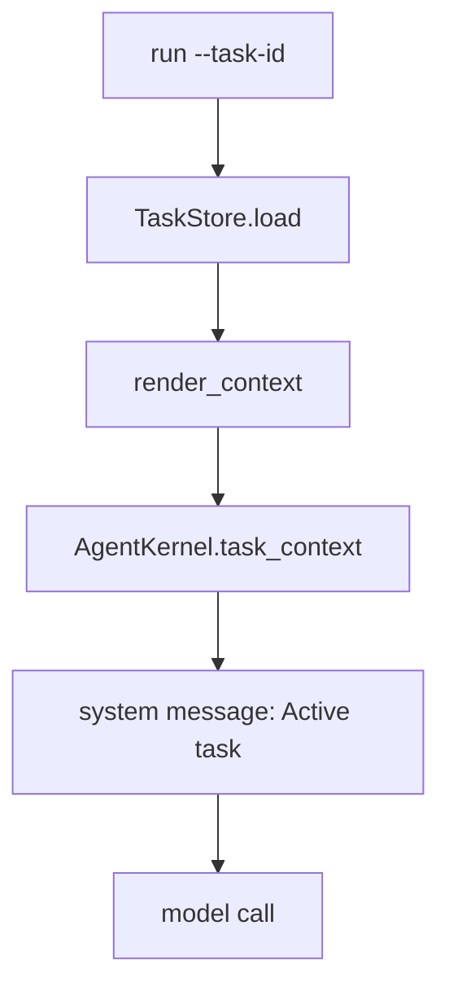

# 019-状态层-Tasks-Active Task Context

## 中文版：让模型知道自己正在做哪件事

### 全局作用

参见：[000-总览-Harness-分层架构与连载目录](000-总览-Harness-分层架构与连载目录.md)。本文位于状态层的 Tasks / Context 分支。

Task Ledger 记录目标，但模型每轮调用时不会自动知道它。Active Task Context 把当前 task 渲染成 system context 注入 Kernel，让模型在执行时看到任务 id、标题、描述、状态和关联 session。

### 输入 / 输出 / 行为

- 输入：`--task-id`、TaskStore。
- 输出：注入 prompt 的 `Active task:` 文本。
- 行为：
  - run 时加载 task。
  - 找不到 task 直接失败，避免模型拿着错误目标运行。
  - session metadata 记录 task id。

### 实现原理与流程图

Active Task Context 是状态层到 Kernel 的桥。CLI 解析 `--task-id`，从 TaskStore 渲染上下文，Kernel 在构建 prompt messages 时把它作为 system message 加入。这样模型不需要从用户 prompt 里猜任务背景。



### 过程记录

这一步把 task 从“外部账本”变成“模型可见上下文”。它让后续自动更新 task 状态、handoff、run diagnose 都能围绕同一个目标展开。

### 当前实现

| 项 | 状态 |
|---|---|
| 层 | 状态层 |
| 模块 | Tasks |
| 子模块 | Active Task Context |
| 实现状态 | 已实现 |
| 对应提交 | `0bae25a Inject active task context` |

- 模块：`TaskStore.render_context`
- CLI/Kernal 接入：`run --task-id`、`AgentKernel.task_context`

### 测试例跑法

```bash
python3 -m pytest tests/test_tasks.py::test_task_store_renders_task_context tests/test_cli_smoke.py::test_cli_tasks_create_update_show_and_associate_run -q
```

读者验证点：task context 可渲染，并且 run 能关联 task/session。

### 未来扩展计划

- 根据 task 类型选择 skill/profile。
- task context 支持压缩摘要和验收标准。
- server 中允许多个 agent 围绕同一 task 协作。

## English Version

Active task context injects the current task into model prompts so the agent can
work against a durable objective instead of only the latest user message.

