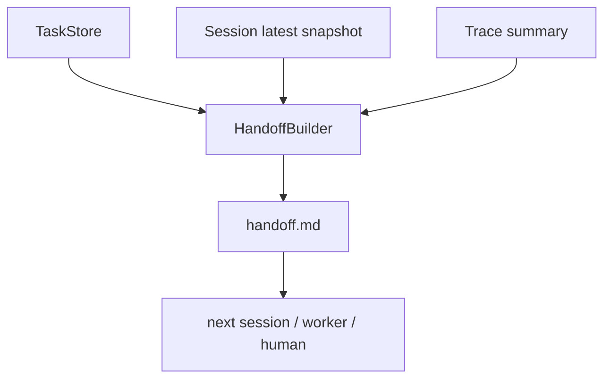

# 020-状态层-Handoff-Session Handoff Generation

## 中文版：让下一个窗口接得住

### 全局作用

参见：[000-总览-Harness-分层架构与连载目录](000-总览-Harness-分层架构与连载目录.md)。本文位于状态层的 Handoff 分支。

长程 Agent 最大的问题之一是上下文会断。Handoff 的作用是把当前 task、session、usage、trace 摘要和最近消息整理成 Markdown，让下一个窗口、下一个 worker 或下一个人能接着做。

### 输入 / 输出 / 行为

- 输入：session、可选 task、trace summary。
- 输出：Markdown handoff 文档。
- 行为：
  - 输出任务信息。
  - 输出 session id、workspace、token/cost。
  - 输出 trace summary。
  - 输出最近消息。

### 实现原理与流程图

HandoffBuilder 不重新理解整个任务，而是从已有状态源抽取接力需要的最小信息。它像接力棒，不替代 memory，也不替代 trace，而是把关键状态用人和模型都能读的 Markdown 汇总起来。



### 过程记录

这一节点是为长程任务接力准备的。我们先做静态 Markdown，而不是复杂自动调度，因为 handoff 的第一价值是清晰、可读、可复制。

### 当前实现

| 项 | 状态 |
|---|---|
| 层 | 状态层 |
| 模块 | Handoff |
| 子模块 | Session Handoff Generation |
| 实现状态 | 已实现 |
| 对应提交 | `178f923 Add session handoff generation` |

- 模块：`harness.handoff.HandoffBuilder`
- CLI：`harness handoff --session <session-id>`

### 测试例跑法

```bash
python3 -m pytest tests/test_handoff.py tests/test_cli_smoke.py::test_cli_handoff_renders_session_summary -q
```

读者验证点：handoff 包含 task、session、usage/cost、trace summary 和最近消息。

### 未来扩展计划

- 自动在 compaction 或 run end 后生成 handoff。
- handoff 支持面向模型的短版和面向人的长版。
- server 中把 handoff 作为任务交接记录。

## English Version

Handoff generation turns task, session, trace, and recent messages into a
Markdown handoff so the next window, worker, or human can continue.

