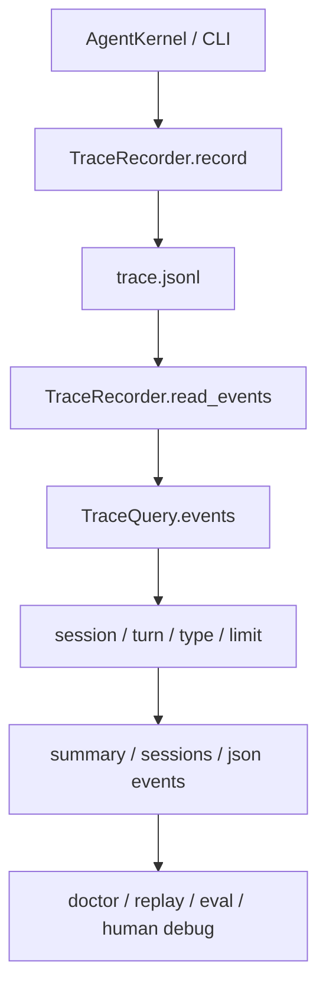

# 021-可观测层-Trace-Query Filters

## 中文版：从完整流水账里查出关键回合

### 全局作用

参见：[000-总览-Harness-分层架构与连载目录](000-总览-Harness-分层架构与连载目录.md)。本文位于可观测层的 Trace 分支。

Trace 是 Agent Harness 的运行事实来源。Query Filters 让 trace 不只是一份 JSONL 日志，而是可以按 session、turn、event type 和 limit 取回的诊断接口，供 replay、doctor、eval 和后续 UI 使用。

### 输入 / 输出 / 行为

- 输入：trace JSONL、可选 `session_id`、`turn_id`、`event_type`、`limit`。
- 输出：过滤后的事件列表，或聚合 summary。
- 行为：
  - `TraceRecorder` 负责追加事件和读取事件。
  - `TraceQuery.events()` 按过滤条件保留目标事件。
  - `TraceQuery.summary()` 在过滤结果上重新统计 turn、model call、tool call、tool error、token 和 cost。
  - `TraceQuery.sessions()` 将事件按 session 聚合，支持 `failures_only`。
- 失败模式：trace 文件不存在时返回空结果；JSONL 损坏时会暴露解析错误，提醒 trace 写入链路有问题。

### 实现原理与流程图

本实现把写入和查询拆开：运行时只追加结构化事件，查询时再做轻量内存过滤。这样不会把诊断索引提前复杂化，也保留了 JSONL 的可读性和可复制性。



### 当前实现

| 项 | 状态 |
|---|---|
| 层 | 可观测层 |
| 模块 | Trace |
| 子模块 | Query Filters |
| 实现状态 | 已实现 |
| 对应提交 | `54a709d Add trace query filters` |

- 模块：`harness.trace.TraceRecorder`、`harness.trace.TraceQuery`
- CLI：`harness trace --session ... --turn ... --type ... --limit ... --json`
- 会话聚合：`harness trace --sessions --failures-only`

### 横向对标

| Harness | 对应实现 | 原理与边界 |
|---|---|---|
| Claude Code | analytics、query profiler、OTel / Perfetto、VCR fixtures | 更偏生产诊断和性能剖析，trace 不只服务 CLI，也服务实验回放和性能定位。 |
| Codex | rollout trace、trace reducer、OTel、state DB | 将对话、工具调用和状态变化组织成可压缩、可回放的数据，用于调试和后续记忆提取。 |
| OpenClaw | gateway logs、diagnostic events、cache trace | 多节点和 gateway 场景下，trace 需要跨消息通道和节点边界聚合。 |
| Hermes Agent | trajectories、batch runner、trajectory compression、Langfuse plugin | 以 trajectory 为中心沉淀运行轨迹，兼顾批量评测和外部观测平台。 |

本仓库当前选择 JSONL + filter 的最小实现，是为了先固定事件结构和验证路径。生产级演进会加入索引、采样、trace reducer 和外部 exporter。

### 测试例跑法

```bash
PYTHONPATH=src python3 -m pytest tests/test_trace_cli.py -q
```

读者验证点：按 session/type/limit 查询时只返回目标事件；summary 会基于过滤结果重新统计。

### 后续扩展

- 增加按时间范围、tool name、error type 查询。
- 增加 trace reducer，把长轨迹压缩成诊断摘要。
- 为 server/UI 提供分页查询接口。

## English Version

Trace query filters turn append-only JSONL events into inspectable runtime
facts. The first implementation keeps storage simple and makes session, turn,
type, limit, and failure views reproducible from the CLI.
