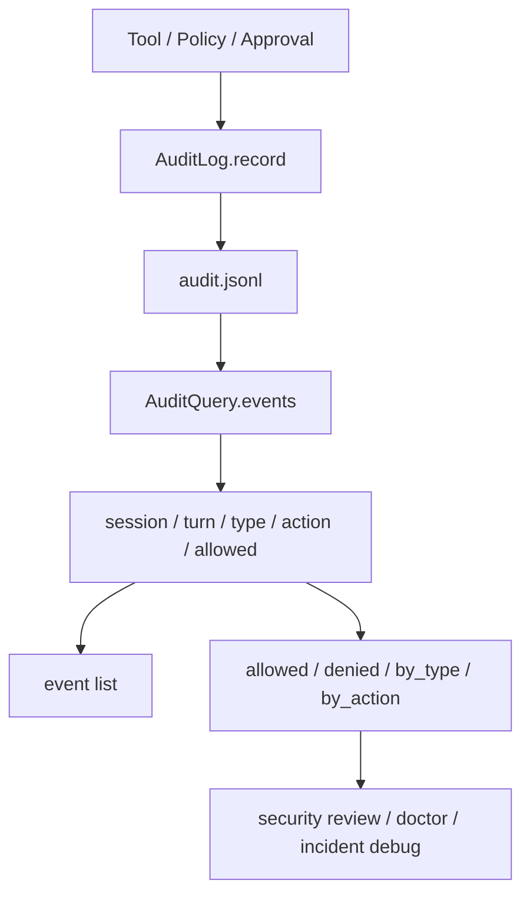

# 022-治理层-Audit-Query Filters

## 中文版：把权限决策变成可审计事实

### 全局作用

参见：[000-总览-Harness-分层架构与连载目录](000-总览-Harness-分层架构与连载目录.md)。本文位于治理层的 Audit 分支。

Audit 记录的是“谁在什么上下文里尝试做什么，系统是否允许”。Query Filters 让权限事件可以按 session、turn、event type、action、allowed 查询，帮助定位越权、拒绝、审批和工具策略问题。

### 输入 / 输出 / 行为

- 输入：audit JSONL、可选 `session_id`、`turn_id`、`event_type`、`action`、`allowed`、`limit`。
- 输出：过滤后的 audit events，或按类型和 action 聚合的 summary。
- 行为：
  - `AuditLog.record()` 追加审计事件。
  - `AuditQuery.events()` 做条件过滤。
  - `AuditQuery.summary()` 统计 allowed、denied、by_type、by_action。
- 失败模式：audit 文件不存在时返回空结果；损坏 JSONL 会直接失败，避免把审计证据静默吞掉。

### 实现原理与流程图

Audit 和 Trace 分离：Trace 描述运行过程，Audit 描述治理决策。两者都可带 `session_id` 和 `turn_id`，但 Audit 额外关注 `actor`、`action`、`allowed` 和拒绝原因。



### 当前实现

| 项 | 状态 |
|---|---|
| 层 | 治理层 |
| 模块 | Audit |
| 子模块 | Query Filters |
| 实现状态 | 已实现 |
| 对应提交 | `8905ecd Add audit query filters` |

- 模块：`harness.audit.AuditLog`、`harness.audit.AuditQuery`
- CLI：`harness audit --session ... --turn ... --type ... --action ... --allowed ... --summary --json`
- 调用点：permission denial、approval、tool call governance。

### 横向对标

| Harness | 对应实现 | 原理与边界 |
|---|---|---|
| Claude Code | permission modes、permission hooks、secure storage、doctor | 把工具权限、配置作用域和安全存储放在控制面与执行层之间，审计要能还原用户授权链路。 |
| Codex | permission profile、approval cache、sandbox policy、state DB | 以 profile 和 approval 为中心控制执行，审计事件需要和 trace、sandbox 结果对齐。 |
| OpenClaw | auth profiles、exec approval、security audit | 多节点执行要求 audit 能跨 gateway、sandbox 和业务身份记录来源。 |
| Hermes Agent | approval、checkpoint、logs、usage / cost、trajectory | 审计与轨迹、成本、回滚结合，用于判断一次 run 是否可信。 |

本仓库先实现轻量 JSONL 审计，是为了把治理事实落盘，并且让策略测试能直接断言事件。后续会补充更强的身份、租户、workspace scope 和审批对象模型。

### 测试例跑法

```bash
PYTHONPATH=src python3 -m pytest tests/test_artifacts_audit.py tests/test_approval.py -q
```

读者验证点：按 action 和 allowed 过滤能只返回目标事件；summary 能区分允许与拒绝。

### 后续扩展

- 增加 workspace、tool name、resource id 维度。
- 将 sandbox 拒绝、path guard 拒绝和模型工具参数错误统一进入 audit。
- 增加审计导出和不可篡改存储选项。

## English Version

Audit query filters make governance decisions inspectable. Trace explains what
happened; audit explains whether a tool, approval, or policy decision was
allowed, denied, and why.
