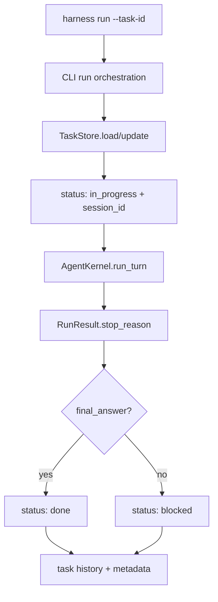

# 023-状态层-Tasks-Auto Update After Runs

## 中文版：让任务状态跟随运行结果变化

### 全局作用

参见：[000-总览-Harness-分层架构与连载目录](000-总览-Harness-分层架构与连载目录.md)。本文位于状态层的 Task 分支。

Task 是长程工作在 session 之外的稳定对象。Auto Update After Runs 让 CLI run 与 task ledger 连起来：run 开始时任务进入 `in_progress`，run 结束后根据 stop reason 自动转成 `done` 或 `blocked`，并记录 session、stop reason 和 iteration。

### 输入 / 输出 / 行为

- 输入：`harness run ... --task-id <id>`、已有 task、模型运行结果。
- 输出：更新后的 task 状态与 history。
- 行为：
  - 运行开始：task 绑定 session 并标记 `in_progress`。
  - 运行成功：`stop_reason == final_answer` 时标记 `done`。
  - 运行失败：其他 stop reason 标记 `blocked`。
  - metadata 写入 `last_stop_reason` 和 `last_iterations`。
- 失败模式：task id 不存在时 CLI 失败；状态非法时由 `TaskStore` 拒绝。

### 实现原理与流程图

Task 更新发生在 CLI 编排层，而不是 Kernel 内部。Kernel 只负责单 turn 行为，CLI 负责把 run record、session 和 task ledger 关联起来。



### 当前实现

| 项 | 状态 |
|---|---|
| 层 | 状态层 |
| 模块 | Tasks |
| 子模块 | Auto Update After Runs |
| 实现状态 | 已实现 |
| 对应提交 | `f097c36 Auto-update task state after runs` |

- 模块：`harness.tasks.TaskStore`
- CLI：`harness tasks`、`harness run --task-id`
- 状态枚举：`todo`、`in_progress`、`done`、`blocked`

### 横向对标

| Harness | 对应实现 | 原理与边界 |
|---|---|---|
| Claude Code | task registry、subagent / forked agent、session handoff | 任务状态更贴近会话和工具流，长程任务通过交接、压缩和子 agent 延续。 |
| Codex | agent roles、hooks、state DB、run records | 本地/桌面运行需要把任务、run、approval、trace 绑定到可恢复状态。 |
| OpenClaw | session routing、cron、ACP control plane | 多端和消息通道场景中，task 更像控制面对象，需要路由到具体 runner。 |
| Hermes Agent | kanban workers、cron、state.db | 使用 worker 与看板状态组织长程任务，任务状态服务调度和复盘。 |

本仓库先让 task 跟随本地 run 自动变化，保证读者能看到 task、session、trace 的最小闭环。复杂调度、多人协作和子 agent 分派留给后续 runtime/control-plane 章节。

### 测试例跑法

```bash
PYTHONPATH=src python3 -m pytest tests/test_tasks.py tests/test_cli.py -q
```

读者验证点：成功 run 会把 task 标记为 `done`；失败 run 会标记为 `blocked`，并保留 history。

### 后续扩展

- 支持 task 依赖、子任务和 owner。
- 支持 run retry 后自动恢复 `in_progress`。
- 将 queued runs 与 task 状态做更细粒度联动。

## English Version

Task auto-update links local runs to durable task state. A task enters
`in_progress` when a run starts and becomes `done` or `blocked` based on the
turn result.
