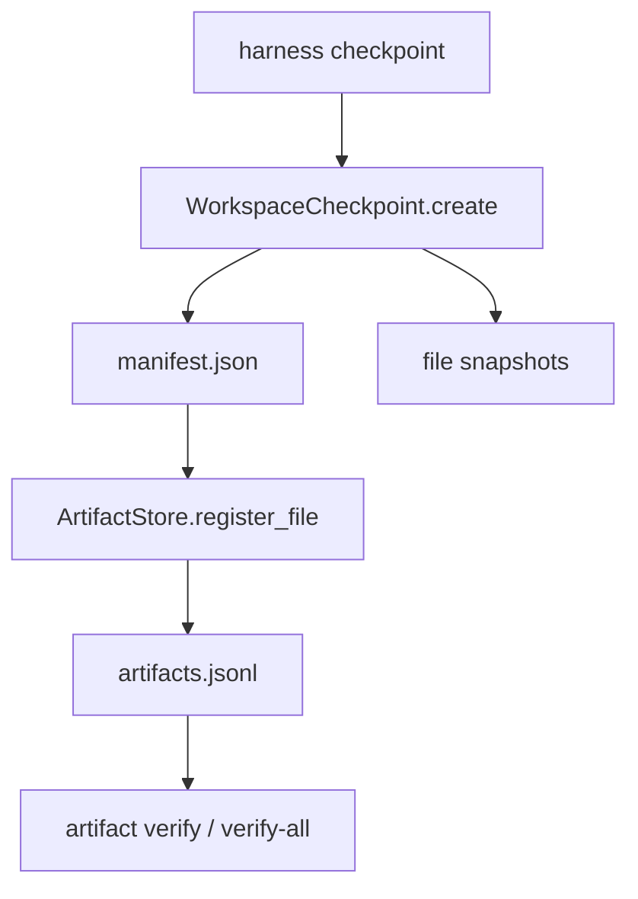

# 024-产物层-CheckpointArtifacts-Manifest Registration

## 中文版：把回滚点登记成可验证产物

### 全局作用

参见：[000-总览-Harness-分层架构与连载目录](000-总览-Harness-分层架构与连载目录.md)。本文位于执行与产物交界处：Checkpoint 属于执行保护，Artifact Registration 属于产物层。

Checkpoint manifest 是工作区某一时刻的可恢复证据。将它登记为 artifact 后，系统能用统一的产物索引验证 manifest 是否存在、是否被篡改，以及对应的 sha256 是否仍然匹配。

### 输入 / 输出 / 行为

- 输入：workspace、checkpoint dir、artifact dir、可选 label。
- 输出：checkpoint manifest，以及 `kind=checkpoint-manifest` 的 artifact 记录。
- 行为：
  - 创建 checkpoint 时扫描 workspace 文件。
  - 写入 manifest。
  - 若配置了 artifact dir，则将 manifest 注册到 `ArtifactStore`。
  - 输出 checkpoint id、manifest path、artifact id。
- 失败模式：workspace 不存在或 manifest 路径不可写时失败；artifact 注册时文件不存在会失败。

### 实现原理与流程图

Checkpoint 负责“可恢复”，Artifact 负责“可证明”。两者不合并，是为了让未来任何重要产物都能进入同一套 artifact 索引，而 checkpoint 只是其中一种 kind。



### 当前实现

| 项 | 状态 |
|---|---|
| 层 | 执行与安全基础设施 / 产物层 |
| 模块 | CheckpointArtifacts |
| 子模块 | Manifest Registration |
| 实现状态 | 已实现 |
| 对应提交 | `b9c1bd8 Register checkpoint manifests as artifacts` |

- 模块：`harness.checkpoint.WorkspaceCheckpoint`、`harness.artifacts.ArtifactStore`
- CLI：`harness checkpoint --artifact-dir ...`
- Artifact kind：`checkpoint-manifest`

### 横向对标

| Harness | 对应实现 | 原理与边界 |
|---|---|---|
| Claude Code | worktree isolation、session state、VCR fixtures | 更强调隔离与可回放，checkpoint 可能由 worktree、session 和测试 fixture 共同支撑。 |
| Codex | platform sandbox、state DB、rollout trace | 执行前后的状态需要能和 trace、approval、sandbox 结果对齐。 |
| OpenClaw | Docker / SSH / OpenShell sandbox、filesystem bridge | checkpoint 常与远端文件系统和 sandbox 边界相关，manifest 需要跨节点定位资源。 |
| Hermes Agent | checkpoint、trajectory、batch runner | checkpoint 与 trajectory 结合，服务失败恢复、复盘和批量运行。 |

本仓库的 manifest artifact 是教学级最小闭环：先证明“回滚点也是产物”。后续生产化会把 artifact 与 trace event、run id、task id 强绑定。

### 测试例跑法

```bash
PYTHONPATH=src python3 -m pytest tests/test_checkpoint.py tests/test_artifacts_audit.py -q
```

读者验证点：创建 checkpoint 后 artifact index 中出现 `checkpoint-manifest`，并可通过 verify 校验。

### 后续扩展

- checkpoint manifest 写入 run id、turn id、task id。
- 支持 checkpoint 压缩与远端存储。
- 在失败回滚时自动登记 restore 事件和恢复后的 diff。

## English Version

Checkpoint manifest registration treats recovery points as verifiable
artifacts. Checkpoints restore state; artifacts prove the manifest still
exists and has not changed.
