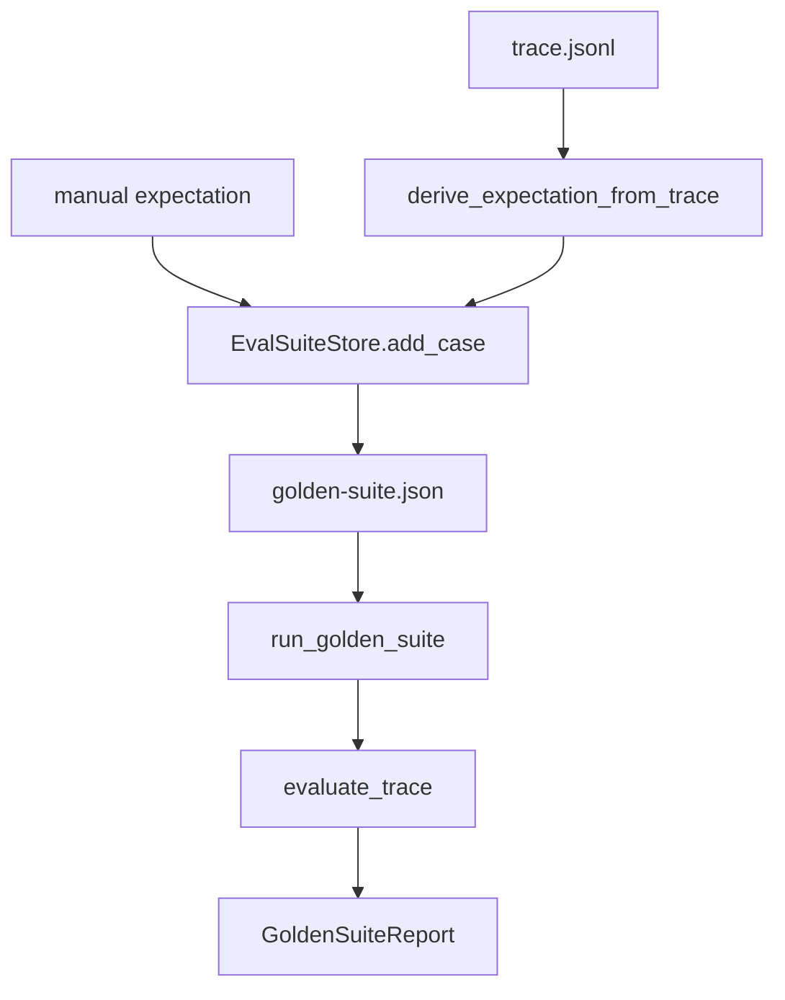

# 025-评测层-EvalSuite-Golden Suite Management

## 中文版：把一次好轨迹变成回归用例

### 全局作用

参见：[000-总览-Harness-分层架构与连载目录](000-总览-Harness-分层架构与连载目录.md)。本文位于评测层的 Eval Suite 分支。

Golden Suite Management 将 trace 变成可保存、可列出、可重复运行的回归用例。它让 Harness 的行为不只靠人工观察，而可以用 stop reason、tool errors、required tools、final text、token 和 cost 约束来自动判定。

### 输入 / 输出 / 行为

- 输入：suite JSON、trace path、期望条件，或从 trace 自动派生期望。
- 输出：suite cases、每个 case 的 eval report、整体 passed/cases 统计。
- 行为：
  - `add_case()` 写入人工期望。
  - `add_case_from_trace()` 从已有 trace 派生期望。
  - `run()` 对 suite 内所有 case 运行 `evaluate_trace()`。
- 失败模式：trace 不存在或 suite JSON 损坏时失败；没有任何检查项时 report 不通过。

### 实现原理与流程图

Eval 不重新执行 Agent，而是先评估已有 trace。这让回归测试稳定、便宜，也避免模型波动影响基础模块验证。后续 live eval 可以在这个基础上补充。



### 当前实现

| 项 | 状态 |
|---|---|
| 层 | 评测层 |
| 模块 | EvalSuite |
| 子模块 | Golden Suite Management |
| 实现状态 | 已实现 |
| 对应提交 | `eddd93b Add eval suite management` |

- 模块：`harness.eval.EvalSuiteStore`、`evaluate_trace()`、`run_golden_suite()`
- CLI：`harness eval-suite <suite> --add ...`、`--add-from-trace ...`、`--list`、`--run`
- 兼容入口：`harness eval`、`harness golden`

### 横向对标

| Harness | 对应实现 | 原理与边界 |
|---|---|---|
| Claude Code | VCR fixtures、analytics、query profiler | 将真实交互固化成可回放样本，用于避免工具协议和上下文策略回归。 |
| Codex | rollout trace、trace reducer、tests | 更强调从 rollout 中提炼失败和成功样本，再用 reducer 降低回归噪声。 |
| OpenClaw | diagnostic events、usage / cost、security audit | 评测要覆盖 gateway、通道、sandbox 和权限，不只是单机 trace。 |
| Hermes Agent | batch runner、trajectories、trajectory compression | 以批量轨迹执行和压缩轨迹支撑 eval，更接近生产任务池。 |

本仓库先做 trace-based golden suite，是为了让每个模块开发后都有低成本回归门禁。复杂模型重跑、任务集和多 agent eval 后续再加入。

### 测试例跑法

```bash
PYTHONPATH=src python3 -m pytest tests/test_regression_doctor.py tests/test_trace_cli.py::test_cli_eval_command_passes_and_fails -q
```

读者验证点：从 trace 添加 case 后，`eval-suite --run` 能输出每个 case 是否通过。

### 后续扩展

- 支持 live replay 执行同一 prompt 并比较新 trace。
- 支持按模块标签组织 suite。
- 引入 trace reducer，减少 golden 文件对细节噪声的敏感度。

## English Version

Golden suite management turns successful or important traces into regression
cases. The first implementation evaluates stored traces rather than re-running
models, keeping the gate stable and cheap.
