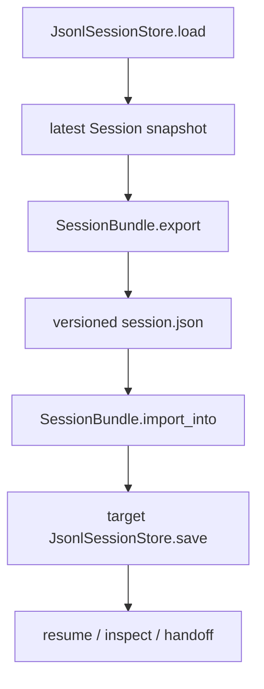

# 026-状态层-Session-Bundle Import Export

## 中文版：把会话状态打包迁移

### 全局作用

参见：[000-总览-Harness-分层架构与连载目录](000-总览-Harness-分层架构与连载目录.md)。本文位于状态层的 Session 分支。

Session Bundle Import Export 解决的是会话状态跨目录、跨机器、跨实验环境迁移的问题。它把某个 session 的最新快照导出为带版本号的 JSON，再导入到另一个 `JsonlSessionStore`。

### 输入 / 输出 / 行为

- 输入：session id、source session store、bundle path、target session store。
- 输出：`session.json` bundle，或导入后的 session snapshot。
- 行为：
  - export 要求 session 存在。
  - bundle 包含 `version` 和完整 `session` 数据。
  - import 校验 bundle version，再保存到目标 store。
- 失败模式：session 缺失时报错；bundle version 不支持时报错；JSON 损坏时报错。

### 实现原理与流程图

Session store 本身是 append-only snapshots；bundle 只导出最新可恢复快照，不导出完整 history。这样保持迁移简单，同时不影响本地 history 继续追加。



### 当前实现

| 项 | 状态 |
|---|---|
| 层 | 状态层 |
| 模块 | Session |
| 子模块 | Bundle Import Export |
| 实现状态 | 已实现 |
| 对应提交 | `90d7125 Add session bundle import export` |

- 模块：`harness.session.SessionBundle`
- CLI：`harness sessions --export <session-id> --output <path>`、`harness sessions --import <path>`
- Store：`JsonlSessionStore`

### 横向对标

| Harness | 对应实现 | 原理与边界 |
|---|---|---|
| Claude Code | remote/direct sessions、SDK streams、context compact | 会话迁移通常与远端会话、压缩上下文和流式 SDK 状态相关。 |
| Codex | history manager、state DB、desktop/app server session state | 会话状态既服务 CLI，也服务桌面和 IDE 协议，需要稳定序列化。 |
| OpenClaw | session routing、Gateway WS / HTTP、subagent session protocol | 会话是跨通道路由对象，导入导出要考虑节点和通道身份。 |
| Hermes Agent | state.db、FTS5 session search、conversation loop | 会话存储更数据库化，并支持检索、压缩和批处理。 |

本仓库先实现单 session 最新快照的 JSON bundle，是为了打通本地实验迁移和文章验证。完整 history、trace、artifact、memory 的整体 bundle 会在后续归档能力中扩展。

### 测试例跑法

```bash
PYTHONPATH=src python3 -m pytest tests/test_session_context.py::test_session_bundle_exports_and_imports_session -q
```

读者验证点：导出的 bundle 可导入到另一个 session store，session id、workspace、messages 保持一致。

### 后续扩展

- 支持包含 session history 的完整 bundle。
- 将 trace、audit、artifacts、memory 一起打包。
- 支持 bundle 签名和敏感字段脱敏。

## English Version

Session bundles move the latest session snapshot across stores. They are
versioned JSON artifacts that make local session migration explicit and
testable.
