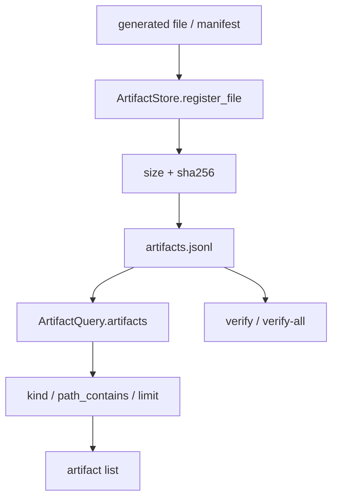

# 027-产物层-Artifacts-Query Filters

## 中文版：让产物索引可以被检索和验证

### 全局作用

参见：[000-总览-Harness-分层架构与连载目录](000-总览-Harness-分层架构与连载目录.md)。本文位于产物层的 Artifacts 分支。

Artifacts 记录 Harness 运行中产生的重要文件。Query Filters 让产物可以按 kind、路径包含关系和 limit 查询，避免 artifact index 只是一份不断增长的流水账。

### 输入 / 输出 / 行为

- 输入：artifact index、可选 `kind`、`path_contains`、`limit`。
- 输出：过滤后的 artifact 列表，或 JSON 输出。
- 行为：
  - `ArtifactStore.register_file()` 记录 path、relative_path、kind、size、sha256。
  - `ArtifactQuery.artifacts()` 做 kind/path/limit 过滤。
  - `ArtifactStore.verify()` 和 `verify_all()` 校验文件是否缺失或变化。
- 失败模式：注册不存在文件会失败；workspace root 与文件路径不匹配时 relative path 计算失败。

### 实现原理与流程图

Artifact index 是“产物目录”。运行时只负责登记文件事实，查询和验证在 CLI 或后续 UI 中按需执行。



### 当前实现

| 项 | 状态 |
|---|---|
| 层 | 产物层 |
| 模块 | Artifacts |
| 子模块 | Query Filters |
| 实现状态 | 已实现 |
| 对应提交 | `cd97f2f Add artifact query filters` |

- 模块：`harness.artifacts.ArtifactStore`、`harness.artifacts.ArtifactQuery`
- CLI：`harness artifacts --kind ... --path-contains ... --limit ... --json`
- 校验：`harness artifacts --verify <id>`、`--verify-all`

### 横向对标

| Harness | 对应实现 | 原理与边界 |
|---|---|---|
| Claude Code | VCR fixtures、worktree outputs、analytics artifacts | 产物既包括工具输出，也包括回放 fixture 和诊断文件。 |
| Codex | rollout trace、state DB、trace reducer outputs | 产物需要和 rollout、state、approval 关联，便于复盘。 |
| OpenClaw | gateway logs、diagnostic events、business tool outputs | 多通道产物要保留来源、节点和业务资源版本。 |
| Hermes Agent | trajectories、batch outputs、trajectory compression | 产物围绕 trajectory 和 batch runner 形成可检索记录。 |

本仓库当前只登记本地文件和哈希，优先建立“产物可查、可验”的基本纪律。后续会把 artifact 与 run/session/task/trace 统一关联。

### 测试例跑法

```bash
PYTHONPATH=src python3 -m pytest tests/test_artifacts_audit.py -q
```

读者验证点：按 kind 和路径过滤 artifact，能返回目标文件；修改文件后 `verify-all` 能识别 changed。

### 后续扩展

- 增加 source、run id、turn id、task id。
- 支持目录产物和远端对象存储。
- 增加 artifact retention 和清理策略。

## English Version

Artifact query filters make generated files searchable and verifiable. The
first implementation records kind, path, size, and sha256 in an append-only
index.
