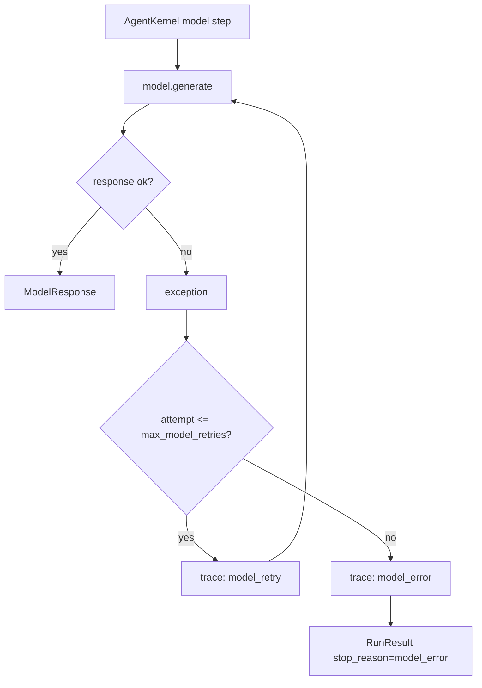

# 028-模型层-Model-Retry Policy

## 中文版：模型临时失败时不要立刻放弃

### 全局作用

参见：[000-总览-Harness-分层架构与连载目录](000-总览-Harness-分层架构与连载目录.md)。本文位于模型接入与 Runtime 交界处。

Model Retry Policy 处理模型调用中的临时失败。它不改变模型协议，也不吞掉错误，而是在 Kernel 中对 `model.generate()` 做有限次数重试，并把每次失败写入 trace。

### 输入 / 输出 / 行为

- 输入：messages、tools、`max_model_retries` 配置。
- 输出：最终 `ModelResponse`，或 `model_error` stop reason。
- 行为：
  - 首次模型调用失败时记录 `model_retry`。
  - 未超过最大重试次数时继续调用。
  - 超出后记录 `model_error` 并结束 turn。
- 失败模式：协议错误、HTTP 错误、网络错误都会按异常处理；重试次数为 0 时保持快速失败。

### 实现原理与流程图

Retry 放在 Kernel，而不是 ModelClient，是因为 retry 是 runtime 策略：它需要影响 trace、turn stop reason、budget 和后续工具执行。ModelClient 保持单次请求语义。



### 当前实现

| 项 | 状态 |
|---|---|
| 层 | Harness Runtime / 模型接入 |
| 模块 | Model |
| 子模块 | Retry Policy |
| 实现状态 | 已实现 |
| 对应提交 | `8702939 Add model retry policy` |

- 配置：`max_model_retries`、`HARNESS_MAX_MODEL_RETRIES`
- CLI：`harness run --max-model-retries <n>`
- Trace：`model_retry`、`model_error`

### 横向对标

| Harness | 对应实现 | 原理与边界 |
|---|---|---|
| Claude Code | model fallback、context compact、query loop | 模型失败不只是重试，还可能触发 fallback、压缩和上下文调整。 |
| Codex | streaming sampling、auto compact、history manager | 采样失败要和流式输出、历史管理、重试边界协调。 |
| OpenClaw | Pi agent loop、tool streaming、subagent session protocol | 多节点 runtime 中，模型失败可能需要回传 gateway 并保持 session 可恢复。 |
| Hermes Agent | auxiliary model、model providers、conversation loop | 多 provider 和辅助模型可以让 retry/fallback 更灵活。 |

本仓库先做同 provider 的有限重试，保证模型临时故障不会破坏 turn 级可观测性。后续再实现 provider fallback、错误分类和指数退避。

### 测试例跑法

```bash
PYTHONPATH=src python3 -m pytest tests/test_kernel.py::test_kernel_retries_transient_model_error tests/test_config.py::test_config_validate_reports_errors_and_warnings -q
```

读者验证点：前几次模型异常会产生 `model_retry` trace，最终成功则继续执行；超限则结束为 `model_error`。

### 后续扩展

- 按错误类型区分可重试与不可重试。
- 加入指数退避和 jitter。
- 支持 provider fallback 与低成本 fallback model。

## English Version

Model retry policy is a runtime concern. The model client performs one request;
the kernel decides whether to retry, record trace events, or end the turn with
`model_error`.
