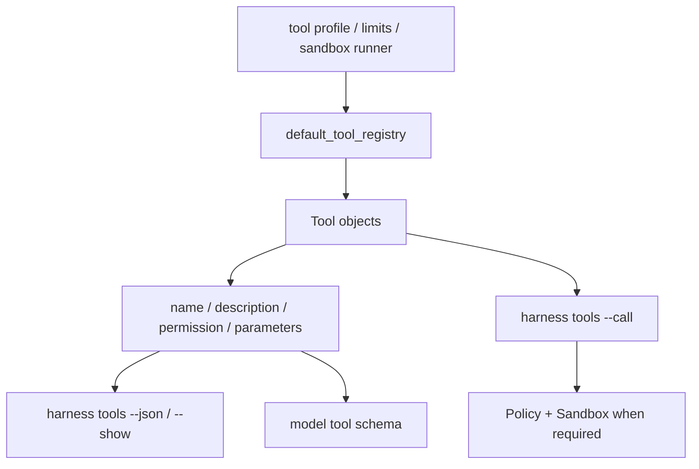

# 029-工具层-Tools-Metadata CLI

## 中文版：让工具能力可以被人和模型检查

### 全局作用

参见：[000-总览-Harness-分层架构与连载目录](000-总览-Harness-分层架构与连载目录.md)。本文位于工具层和控制面的 Tool Registry 分支。

Tools Metadata CLI 让内置工具不仅能被模型调用，也能被人通过 CLI 查看。每个工具暴露 name、description、permission、parameters 等元数据，帮助调试工具注册、权限配置和模型工具 schema。

### 输入 / 输出 / 行为

- 输入：`harness tools`、可选 `--show <tool>`、`--json`、tool profile 和权限配置。
- 输出：工具列表、单个工具 metadata、或 JSON 格式 schema。
- 行为：
  - 从 `default_tool_registry()` 构建当前工具集。
  - CLI 列出工具名和描述。
  - `--show` 输出目标工具 metadata。
  - `--call` 可直接执行工具，用于工具层烟测。
- 失败模式：工具不存在时报错；参数不是 JSON object 时失败；权限或 sandbox 拒绝时返回工具错误。

### 实现原理与流程图

工具 metadata 来自 Tool 对象本身。注册中心负责收集工具，CLI 负责展示或调用，Kernel 使用同一份 schema 提供给模型。



### 当前实现

| 项 | 状态 |
|---|---|
| 层 | 工具层 / Agent Control Plane |
| 模块 | Tools |
| 子模块 | Metadata CLI |
| 实现状态 | 已实现 |
| 对应提交 | `04bb62a Expose tool metadata in CLI` |

- 模块：`harness.tools.default_tool_registry`
- CLI：`harness tools`、`harness tools --show <tool>`、`harness tools --json`
- 相关能力：`--call`、`--args-json`、`--permission`、`--tool-profile`

### 横向对标

| Harness | 对应实现 | 原理与边界 |
|---|---|---|
| Claude Code | Tool pool、MCP config scopes、Skill / Plugin / Agent registry | 工具池与 MCP、skill、agent registry 共同形成控制面，metadata 直接影响模型可见能力。 |
| Codex | ToolRouter、MCP servers、plugin marketplace、skill loader | 工具路由负责把内置工具、插件和 MCP 统一成可调用接口。 |
| OpenClaw | plugin registry、skills gating、business tools | 工具能力受插件注册、技能门控和业务通道影响。 |
| Hermes Agent | toolsets、tool registry、MCP config、skills hub | 以 toolset 组织可用工具，并和 skill、model provider、sandbox 一起装配 runtime。 |

本仓库当前只覆盖本地内置工具 metadata，还没有 MCP server、外部 plugin 和 subagent tool。这样做是为了先把工具 schema、权限和沙箱边界验证清楚。

### 测试例跑法

```bash
PYTHONPATH=src python3 -m pytest tests/test_tools_workspace.py tests/test_cli.py -q
```

读者验证点：`harness tools --json` 能看到工具 schema；`--show read_file` 能看到单工具 metadata。

### 后续扩展

- 增加 MCP tool registry。
- 增加 skill-provided tools 的运行时加载。
- 增加 tool capability tags，区分文件、执行、浏览器、业务资源和诊断工具。

## English Version

Tools metadata CLI exposes the same tool definitions that the runtime sends to
the model. This keeps tool registration, permission policy, and schema debugging
visible from the command line.
