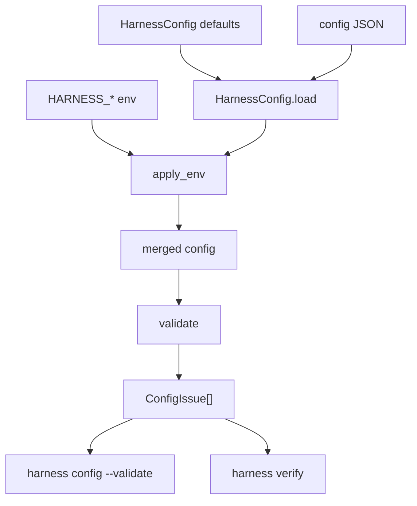

# 030-治理层-Config-Validation

## 中文版：启动前先检查配置边界

### 全局作用

参见：[000-总览-Harness-分层架构与连载目录](000-总览-Harness-分层架构与连载目录.md)。本文位于治理层的 Config 分支。

Config Validation 在运行前检查 Harness 配置是否自洽。它覆盖权限模式、工具 profile、资源限制、模型参数、endpoint/API key 配对、allow/deny tool 冲突等基础边界，避免错误配置进入 runtime 后才暴露。

### 输入 / 输出 / 行为

- 输入：默认配置、JSON config、环境变量覆盖。
- 输出：`ConfigIssue` 列表，包含 `level`、`key`、`message`。
- 行为：
  - `HarnessConfig.load()` 加载文件并应用环境变量。
  - `validate()` 返回 error 和 warn。
  - CLI `harness config --validate` 有 error 时非零退出。
  - `harness verify` 可执行配置校验门禁。
- 失败模式：配置 JSON 解析失败直接报错；error 阻止验证通过；warn 只提示风险。

### 实现原理与流程图

配置合并和配置验证分开：load 只负责得到最终配置，validate 负责判断配置是否合理。这样 CLI、verify、server 未来都能复用同一个验证函数。



### 当前实现

| 项 | 状态 |
|---|---|
| 层 | 治理层 |
| 模块 | Config |
| 子模块 | Validation |
| 实现状态 | 已实现 |
| 对应提交 | `bf64485 Add harness config validation` |

- 模块：`harness.config.HarnessConfig.validate`
- CLI：`harness config --show --validate --json`
- Verify：`harness verify` 默认包含配置校验，除非显式 `--skip-config-validation`

### 横向对标

| Harness | 对应实现 | 原理与边界 |
|---|---|---|
| Claude Code | MCP config scopes、permission modes、feature flags、doctor | 配置作用域和权限模式直接影响工具可见性与安全边界。 |
| Codex | config layering、permission profile、hooks、doctor | 配置分层决定 CLI、桌面、IDE、插件和 sandbox 的行为一致性。 |
| OpenClaw | auth profiles、agent bindings、session routing、ACP control plane | 配置需要跨 gateway、节点、插件和授权资料生效。 |
| Hermes Agent | model providers、toolsets、plugins、doctor | provider、toolset、sandbox、memory 和 plugin 配置需要统一诊断。 |

本仓库先做本地配置自洽检查，重点保障 runtime 不被明显错误配置污染。后续会加入 schema 文件、配置来源追踪和 workspace scope 校验。

### 测试例跑法

```bash
PYTHONPATH=src python3 -m pytest tests/test_config.py tests/test_verify.py -q
```

读者验证点：非法 permission、负数限制、allow/deny 重叠会产生 error；base_url 与 api_key 缺一会产生 warn。

### 后续扩展

- 增加 JSON Schema 导出。
- 显示每个配置值来自默认值、文件、环境变量还是 CLI 参数。
- 校验 sandbox runner、workspace scope 和外部 provider 连通性。

## English Version

Config validation checks the merged local harness configuration before runtime.
It catches invalid modes, unsafe limits, endpoint/key mismatches, and conflicting
tool allow/deny lists.
