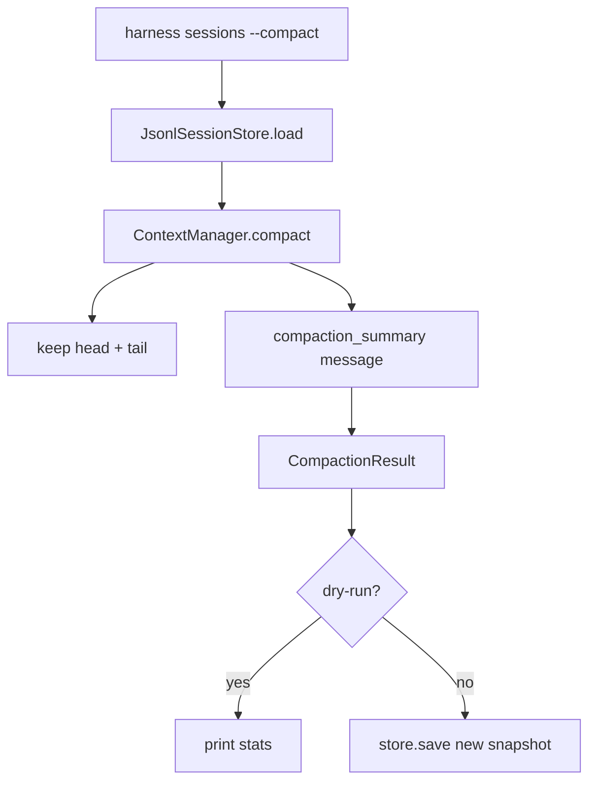

# 031-状态层-Session-Persistent Compaction

## 中文版：压缩后要真正写回会话

### 全局作用

参见：[000-总览-Harness-分层架构与连载目录](000-总览-Harness-分层架构与连载目录.md)。本文位于状态层的 Session / Context Compaction 分支。

Persistent Compaction 解决的是长会话上下文过长的问题：不仅在运行时临时压缩消息，还可以通过 CLI 将压缩后的 session snapshot 写回本地 store，让下一次恢复会话时直接使用较短上下文。

### 输入 / 输出 / 行为

- 输入：session id、`max_messages`、`keep_head`、`keep_tail`、可选 `--dry-run`。
- 输出：压缩统计；非 dry-run 时写入新的 session snapshot。
- 行为：
  - 保留头部和尾部消息。
  - 将中间消息合成为一条 `compaction_summary` system message。
  - 更新 session metadata：`compacted`、`last_compaction_dropped_messages`。
  - dry-run 只输出统计，不落盘。
- 失败模式：session 不存在时报错；压缩参数非法时报错。

### 实现原理与流程图

ContextManager 只负责纯函数式压缩，CLI 负责加载 session、调用 compact、决定是否保存。这样 runtime 压缩和人工维护压缩可以复用同一套逻辑。



### 当前实现

| 项 | 状态 |
|---|---|
| 层 | 状态层 |
| 模块 | Session / Context |
| 子模块 | Persistent Compaction |
| 实现状态 | 已实现 |
| 对应提交 | `5f9b08d Add persistent session compaction` |

- 模块：`harness.context.ContextManager`
- CLI：`harness sessions --compact <session-id> --max-messages ... --keep-head ... --keep-tail ...`
- Store：`JsonlSessionStore.save()` 追加新 snapshot。

### 横向对标

| Harness | 对应实现 | 实现原理 |
|---|---|---|
| Claude Code | context compact、多级 tool output 裁剪、session handoff | 压缩与模型 KV cache、工具输出保留策略、接力上下文一起设计。 |
| Codex | auto compact、history manager、trace reducer | 会话历史会在运行时按窗口压力压缩，并保留可追溯历史。 |
| OpenClaw | context engine、subagent session protocol | context engine 为多通道/子会话准备可加载上下文。 |
| Hermes Agent | context compressor、trajectory compression | 压缩同时服务 runtime 上下文和轨迹复盘。 |

本仓库先做可读的摘要消息和可验证的落盘 snapshot，便于读者观察压缩前后 session 结构。后续会加入模型驱动摘要和按需恢复原文。

### 测试例跑法

```bash
PYTHONPATH=src python3 -m pytest tests/test_session_context.py::test_context_manager_compact_returns_stats_and_metadata tests/test_cli_smoke.py::test_cli_sessions_compact_persists_summary -q
```

读者验证点：压缩后消息数减少，session history 多一个 snapshot，metadata 标记压缩结果。

### 后续扩展

- 使用模型生成更高质量摘要。
- 按 trace/tool output 类型决定保留粒度。
- 支持压缩前 checkpoint 和可逆恢复。

## English Version

Persistent compaction writes compacted session state back to the local store, so
future resumes start from a shorter context rather than repeating temporary
runtime trimming.
