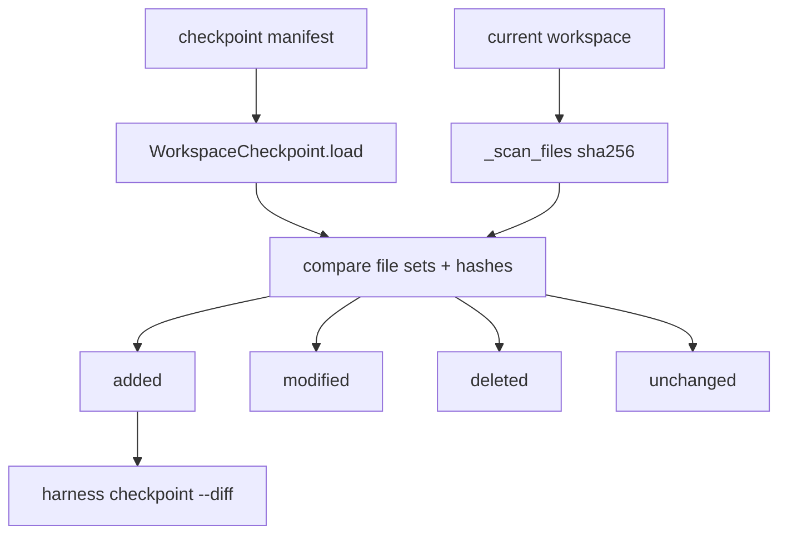

# 032-执行层-Checkpoint-Workspace Diff

## 中文版：回滚前先知道工作区变了什么

### 全局作用

参见：[000-总览-Harness-分层架构与连载目录](000-总览-Harness-分层架构与连载目录.md)。本文位于执行与安全基础设施层的 Checkpoint 分支。

Workspace Diff 用 checkpoint manifest 对比当前 workspace，输出 added、modified、deleted、unchanged。它让回滚不再是盲操作，也让失败恢复前后的差异可以进入 trace、doctor 或人工审查。

### 输入 / 输出 / 行为

- 输入：checkpoint manifest path、workspace path。
- 输出：`WorkspaceDiff`，包含四类路径和 `clean` 判断。
- 行为：
  - 扫描当前 workspace 文件 sha256。
  - 读取 checkpoint manifest 中的文件 sha256。
  - 集合对比生成 added/deleted。
  - hash 对比生成 modified/unchanged。
- 失败模式：manifest 不存在或 JSON 损坏时报错；workspace 不存在时按空目录处理。

### 实现原理与流程图

Diff 不依赖 git，而是依赖 checkpoint 自己的 manifest。这样即使 workspace 不是 git 仓，也能得到可恢复点与当前状态的差异。



### 当前实现

| 项 | 状态 |
|---|---|
| 层 | 执行与安全基础设施 |
| 模块 | Checkpoint |
| 子模块 | Workspace Diff |
| 实现状态 | 已实现 |
| 对应提交 | `73b8326 Add checkpoint workspace diff` |

- 模块：`harness.checkpoint.WorkspaceCheckpoint.diff`
- CLI：`harness checkpoint --diff <manifest>`
- 数据结构：`WorkspaceDiff`

### 横向对标

| Harness | 对应实现 | 实现原理 |
|---|---|---|
| Claude Code | worktree isolation、file edit、VCR fixtures | 通过 worktree 和编辑记录理解任务修改面，方便回滚和测试复现。 |
| Codex | exec-server、approval cache、state DB | 执行结果与状态记录绑定，diff 可作为 approval 和回滚依据。 |
| OpenClaw | filesystem bridge、Docker / SSH sandbox | 远端或容器文件系统需要跨边界比较变更。 |
| Hermes Agent | checkpoint、batch runner、trajectory | checkpoint diff 服务批量任务失败恢复和轨迹复盘。 |

本仓库采用 manifest hash diff，避免依赖 git，也让任意 workspace 都能参与本地 harness 运行。

### 测试例跑法

```bash
PYTHONPATH=src python3 -m pytest tests/test_checkpoint.py::test_workspace_checkpoint_diff_reports_added_modified_and_deleted tests/test_checkpoint.py::test_cli_checkpoint_diff -q
```

读者验证点：创建 checkpoint 后修改、删除、新增文件，diff 能准确分类。

### 后续扩展

- 将 diff 自动写入 run failure 诊断。
- 支持大文件跳过和目录 ignore 规则。
- 支持 diff 结果生成补丁格式。

## English Version

Workspace diff compares a checkpoint manifest with the current workspace using
file hashes. It works even without git and makes restore decisions inspectable.
