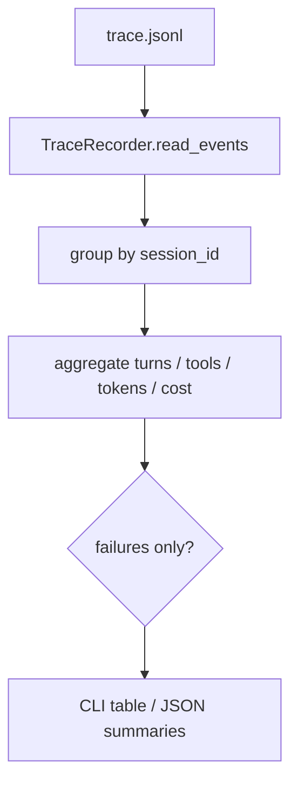

# 033-可观测层-Trace-Session Summaries

## 中文版：按会话看清一次运行的轮廓

### 全局作用

参见：[000-总览-Harness-分层架构与连载目录](000-总览-Harness-分层架构与连载目录.md)。本文位于可观测层的 Trace 分支。

Trace Session Summaries 将事件按 session 聚合，输出 turns、model calls、tool calls、tool errors、token、cost、stop reason 和 final text。它是 run 复盘、失败筛选和后续 dashboard 的基础视图。

### 输入 / 输出 / 行为

- 输入：trace JSONL、可选 `--sessions`、`--failures-only`、`--session`、`--limit`。
- 输出：session summary 列表，或 JSON。
- 行为：
  - 按 `session_id` 分组。
  - 统计事件数量、耗时、工具错误、token 和 cost。
  - 使用最后一个 `turn_end` 的 stop reason 和 final text。
  - `failures_only` 过滤非正常结束或有工具错误的 session。
- 失败模式：没有 trace 事件时返回空列表。

### 实现原理与流程图

summary 是 trace 的派生视图，不单独存储。这样只要 trace 可信，summary 就可以重复计算。



### 当前实现

| 项 | 状态 |
|---|---|
| 层 | 可观测层 |
| 模块 | Trace |
| 子模块 | Session Summaries |
| 实现状态 | 已实现 |
| 对应提交 | `35ceee2 Add trace session summaries` |

- 模块：`harness.trace.summarize_sessions`、`TraceQuery.sessions`
- CLI：`harness trace --sessions --failures-only --json`

### 横向对标

| Harness | 对应实现 | 实现原理 |
|---|---|---|
| Claude Code | analytics、query profiler、usage | 聚合会话指标用于性能、成本和失败原因定位。 |
| Codex | rollout trace、trace reducer | rollout 维度总结可以支撑自动回归和记忆提取。 |
| OpenClaw | gateway logs、diagnostic events | 多通道 session summary 需要跨 gateway 聚合。 |
| Hermes Agent | trajectories、usage / cost、batch runner | trajectory summary 直接服务批量任务评估。 |

本仓库先提供本地 JSONL 的 session summary，让 CLI 也能拥有 dashboard 的核心视角。

### 测试例跑法

```bash
PYTHONPATH=src python3 -m pytest tests/test_trace_cli.py::test_trace_query_summarizes_sessions tests/test_trace_cli.py::test_cli_trace_sessions_summary -q
```

读者验证点：多个 session 的 trace 会被分别聚合；失败过滤只保留异常 session。

### 后续扩展

- 增加按时间范围和 workspace 聚合。
- 支持 summary 缓存和分页。
- 增加 cost/token 趋势报表。

## English Version

Trace session summaries aggregate raw trace events into per-session runtime
views for debugging, cost review, and future dashboards.
