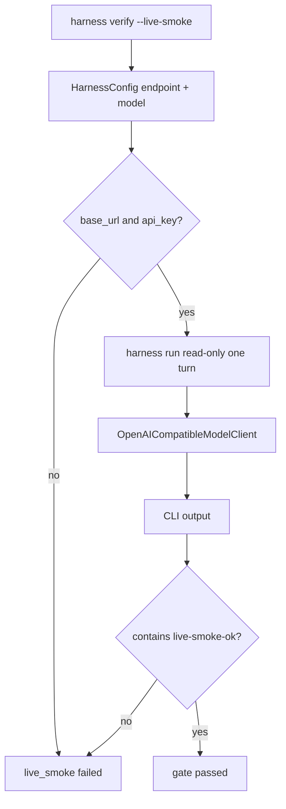

# 034-验证层-Verify-Live Model Smoke

## 中文版：用真实模型确认接入链路

### 全局作用

参见：[000-总览-Harness-分层架构与连载目录](000-总览-Harness-分层架构与连载目录.md)。本文位于验证层的 Verify 分支。

Live Model Smoke 用真实 OpenAI-compatible endpoint 跑一个最小请求，确认 base URL、API key、model、timeout、CLI run 和模型响应解析链路可用。它默认不开启，避免本地测试依赖网络和费用。

### 输入 / 输出 / 行为

- 输入：`HARNESS_BASE_URL`、`HARNESS_API_KEY`、`HARNESS_MODEL` 或对应 config，`harness verify --live-smoke`。
- 输出：verify report 中的 `live_smoke` 结果。
- 行为：
  - 缺少 endpoint/key 时失败。
  - 发起 `harness run`，要求模型回复 `live-smoke-ok`。
  - 输出中缺少期望文本则失败。
- 失败模式：网络、鉴权、模型名、协议解析、输出不匹配都会让该 gate fail。

### 实现原理与流程图

Live smoke 是 verify 的可选 gate。它不替代 mock smoke 和 pytest，而是专门覆盖真实模型链路。



### 当前实现

| 项 | 状态 |
|---|---|
| 层 | 验证层 |
| 模块 | Verify |
| 子模块 | Live Model Smoke |
| 实现状态 | 已实现 |
| 对应提交 | `6996c42 Harden live model verification` |

- 模块：`harness.verify._run_live_smoke`
- CLI：`harness verify --live-smoke`
- 默认：未 opt-in 时跳过。

### 横向对标

| Harness | 对应实现 | 实现原理 |
|---|---|---|
| Claude Code | doctor、SDK streams、model fallback | doctor 需要覆盖模型接入、流式协议和 fallback 行为。 |
| Codex | doctor、tests、app server checks | 本地/桌面/IDE 多入口都需要确认模型配置生效。 |
| OpenClaw | diagnostic events、gateway health | live smoke 需要穿过 gateway 和 runner。 |
| Hermes Agent | doctor、batch runner、model providers | 多 provider 环境下 smoke test 用于确认当前 provider 可用。 |

本仓库把 live smoke 放进 verify，但默认关闭，是为了保持 CI 稳定，同时保留真实模型验证入口。

### 测试例跑法

```bash
PYTHONPATH=src python3 -m pytest tests/test_verify.py::test_live_smoke_requires_expected_text tests/test_verify.py::test_live_smoke_passes_when_expected_text_is_present -q
```

真实模型验证示例：

```bash
HARNESS_BASE_URL=https://api.deepseek.com HARNESS_API_KEY=*** HARNESS_MODEL=deepseek-v4-pro PYTHONPATH=src python3 -m harness.cli verify --work-dir /private/tmp/harness_verify_live --live-smoke --skip-tests --skip-compile --skip-config-validation
```

读者验证点：mocked subprocess 返回期望文本时 gate 通过；真实 endpoint 可用时输出 `live_smoke: passed`。

### 后续扩展

- 增加 live tool smoke 到默认可选套件。
- 对鉴权、限流、模型不存在做错误分类。
- 输出 redacted endpoint 诊断。

## English Version

Live model smoke is an opt-in verification gate that confirms the real
OpenAI-compatible model path works end to end.
