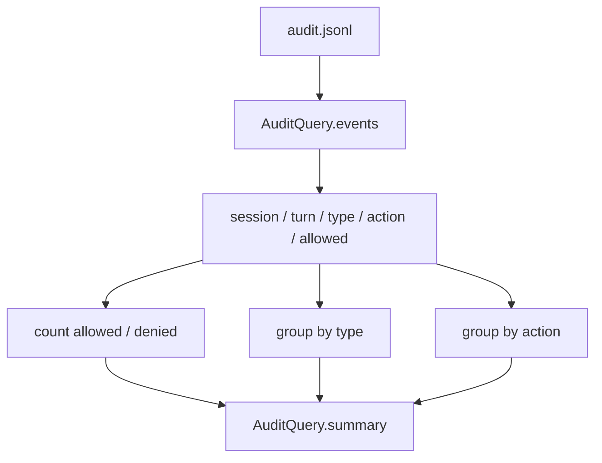

# 035-治理层-Audit-Governance Summaries

## 中文版：把审计事件汇总成治理视图

### 全局作用

参见：[000-总览-Harness-分层架构与连载目录](000-总览-Harness-分层架构与连载目录.md)。本文位于治理层的 Audit 分支。

Governance Summaries 将 audit events 聚合为 allowed、denied、by_type、by_action。它帮助快速判断一次运行中哪些动作被允许、哪些被拒绝，以及拒绝是否集中在某类工具上。

### 输入 / 输出 / 行为

- 输入：audit JSONL、可选 session、turn、type、action、allowed。
- 输出：summary dict 或 CLI 文本/JSON。
- 行为：
  - 先按过滤条件取事件。
  - 统计允许和拒绝数量。
  - 按事件类型与 action 分组。
  - 支持 `harness audit --summary --json`。
- 失败模式：空 audit 返回零计数；损坏 JSONL 直接失败。

### 实现原理与流程图

summary 不替代原始 audit，它只是审计证据的派生视图。真正的安全复盘仍然可以回到逐条 event。



### 当前实现

| 项 | 状态 |
|---|---|
| 层 | 治理层 |
| 模块 | Audit |
| 子模块 | Governance Summaries |
| 实现状态 | 已实现 |
| 对应提交 | `e7b392c Add audit governance summaries` |

- 模块：`harness.audit.AuditQuery.summary`
- CLI：`harness audit --summary`
- 诊断联动：`harness runs --diagnose` 会包含 audit summary。

### 横向对标

| Harness | 对应实现 | 实现原理 |
|---|---|---|
| Claude Code | permission modes、permission hooks、doctor | 将工具授权和拒绝事件汇总为用户可理解的安全状态。 |
| Codex | permission profile、approval cache、sandbox policy | governance summary 需要覆盖 profile、approval 和 sandbox 拒绝。 |
| OpenClaw | auth profiles、security audit、exec approval | 需要跨用户、节点和业务资源汇总授权结果。 |
| Hermes Agent | approval、logs、usage / cost | 审计摘要和运行轨迹一起支撑任务复盘。 |

本仓库当前按 action/type 聚合，先覆盖本地工具治理的核心问题。租户、角色、资源版本会在 server 阶段展开。

### 测试例跑法

```bash
PYTHONPATH=src python3 -m pytest tests/test_artifacts_audit.py::test_audit_query_summarizes_events tests/test_artifacts_audit.py::test_cli_audit_summary -q
```

读者验证点：summary 能区分 allowed 与 denied，并列出 by_type/by_action。

### 后续扩展

- 增加按 workspace、tool category、sandbox result 聚合。
- 支持风险等级和审批耗时。
- 生成治理报告 artifact。

## English Version

Governance summaries aggregate audit events into allowed/denied counts and
type/action groups while keeping the raw audit log as the source of truth.
