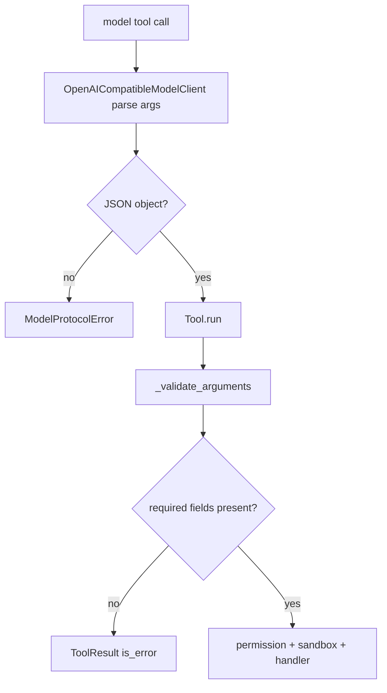

# 036-工具层-Tools-Argument Validation

## 中文版：工具调用先过参数边界

### 全局作用

参见：[000-总览-Harness-分层架构与连载目录](000-总览-Harness-分层架构与连载目录.md)。本文位于工具层的 Tool Execution 分支。

Argument Validation 确保模型或 CLI 传入工具的参数是 JSON object，并包含工具 schema 要求的必填字段。它是 path guard、permission、sandbox 之前的第一道工具边界。

### 输入 / 输出 / 行为

- 输入：tool call arguments、tool parameters schema。
- 输出：正常执行的 `ToolResult`，或参数错误 `ToolResult(is_error=True)`。
- 行为：
  - 非 dict 参数直接拒绝。
  - 缺少 required 字段直接拒绝。
  - 未声明字段当前允许透传，用于 runtime 注入参数。
  - CLI `--args-json` 不是 object 时直接退出。
- 失败模式：模型返回非法 tool arguments 时 `ModelProtocolError`；工具运行时参数不合规则返回工具错误。

### 实现原理与流程图

参数验证分两段：模型协议解析阶段保证 tool arguments 可解析为 object；工具执行阶段根据每个 Tool 的 schema 检查 required 字段。



### 当前实现

| 项 | 状态 |
|---|---|
| 层 | 工具层 |
| 模块 | Tools |
| 子模块 | Argument Validation |
| 实现状态 | 已实现 |
| 对应提交 | `1bb2bf8 Validate tool call arguments` |

- 模块：`harness.model.OpenAICompatibleModelClient._parse_tool_calls`、`harness.tools.Tool._validate_arguments`
- CLI：`harness tools --call ... --args-json ...`

### 横向对标

| Harness | 对应实现 | 实现原理 |
|---|---|---|
| Claude Code | streaming tool executor、tool pool、permission hooks | 参数验证与权限 hook、工具执行流绑定，避免坏参数进入执行层。 |
| Codex | ToolRouter、unified exec、approval cache | ToolRouter 需要在路由前确认 schema 与权限。 |
| OpenClaw | plugin registry、exec approval、business tools | 插件工具参数要在跨节点执行前验证。 |
| Hermes Agent | tool registry、toolsets、approval | toolset 中的工具需要统一 schema 和执行前校验。 |

本仓库当前实现 required/object 级验证，保持简单可测。后续可引入完整 JSON Schema validation。

### 测试例跑法

```bash
PYTHONPATH=src python3 -m pytest tests/test_model_client.py::test_openai_client_reports_invalid_tool_arguments tests/test_tools_workspace.py::test_tool_reports_non_object_arguments tests/test_cli_smoke.py::test_cli_tools_can_call_tool_with_json_args -q
```

读者验证点：非法 JSON、非 object 参数、缺少必填字段都会在执行前被拒绝。

### 后续扩展

- 支持完整 JSON Schema 类型校验。
- 将参数错误写入 audit 与 trace。
- 增加 tool-specific validator。

## English Version

Tool argument validation rejects malformed tool calls before permission,
workspace, or sandbox boundaries are crossed.
