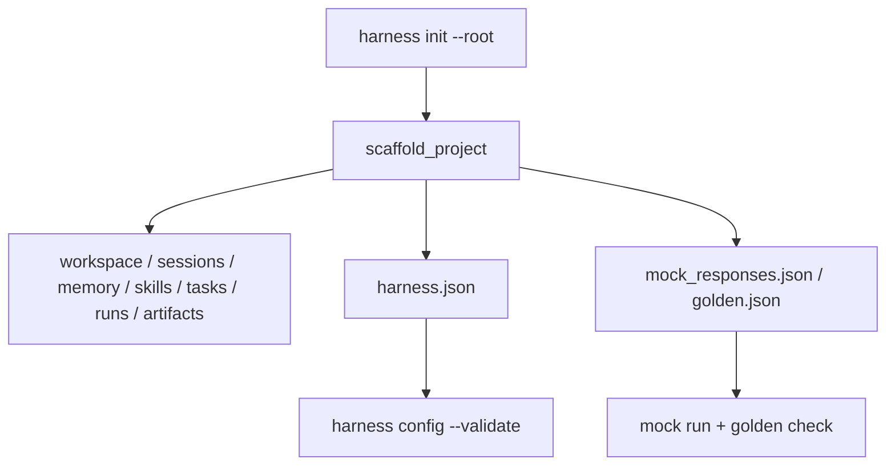

# 037-体验层-Init-Scaffold Sync Checks

## 中文版：初始化出来的项目必须能跑通本地检查

### 全局作用

参见：[000-总览-Harness-分层架构与连载目录](000-总览-Harness-分层架构与连载目录.md)。本文位于体验层和验证层交界处。

Init Scaffold Sync Checks 确保 `harness init` 生成的目录、配置、mock responses、golden suite 与当前 CLI 能力保持同步。初始化不是模板展示，而是可运行的本地 harness 最小项目。

### 输入 / 输出 / 行为

- 输入：root path、可选 `--overwrite`。
- 输出：harness.json、hooks.json、samples、workspace、sessions、memory、skills、tasks、runs、artifacts。
- 行为：
  - 生成完整路径配置。
  - 默认 workspace-write，但 deny `bash`，体现轻量安全默认值。
  - 生成 mock responses 和 golden suite。
  - 不覆盖已有文件，除非显式 `--overwrite`。
- 失败模式：目标路径不可写时报错。

### 实现原理与流程图

Scaffold 直接复用当前配置字段，不维护另一套模板协议。测试会运行 init 后的 config validate、mock run、trace、audit 等命令，防止模板过时。



### 当前实现

| 项 | 状态 |
|---|---|
| 层 | Experience & Gateway / 验证层 |
| 模块 | Init |
| 子模块 | Scaffold Sync Checks |
| 实现状态 | 已实现 |
| 对应提交 | `ea3569d Sync init scaffold with local harness checks` |

- 模块：`harness.scaffold.scaffold_project`
- CLI：`harness init --root ...`
- 样例：`samples/mock_responses.json`、`samples/golden.json`

### 横向对标

| Harness | 对应实现 | 实现原理 |
|---|---|---|
| Claude Code | CLI/TUI onboarding、CLAUDE.md、doctor | 初始化会把用户工作区、指导文件和诊断能力连接起来。 |
| Codex | TUI/CLI、AGENTS.md、doctor、config layering | 初始化体验需要让配置、项目指导和诊断命令一致。 |
| OpenClaw | Control UI、Gateway、nodes、plugins | 初始化更偏多节点和 gateway 注册。 |
| Hermes Agent | CLI/TUI、skills hub、state.db、doctor | 初始化需要准备本地状态、技能和 provider 配置。 |

本仓库的 init 先服务本地教学项目：一条命令生成可验证目录，再用 mock smoke 证明它没有过时。

### 测试例跑法

```bash
PYTHONPATH=src python3 -m pytest tests/test_init_scaffold.py -q
```

读者验证点：init 后可以用生成的 config 跑 config validate、mock run、trace 和 audit summary。

### 后续扩展

- 增加 server 项目模板。
- 增加 MCP/skill 示例。
- 生成 README 和任务样例。

## English Version

Init scaffold sync checks keep generated local projects runnable. The scaffold
creates config, sample responses, a golden suite, and all state directories used
by the current CLI.
