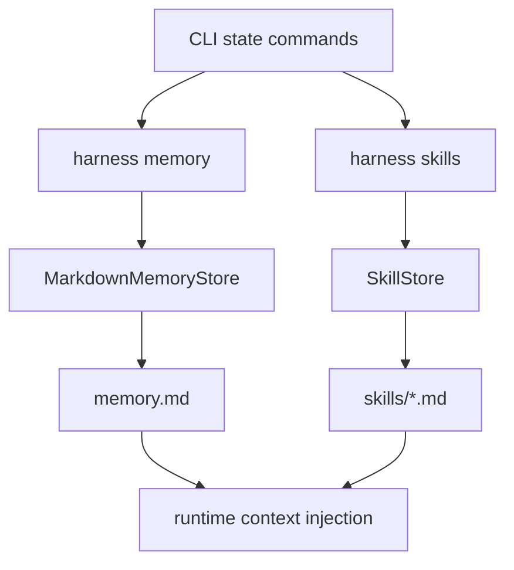

# 038-状态层-State-Maintenance Commands

## 中文版：Memory 和 Skill 要能被本地维护

### 全局作用

参见：[000-总览-Harness-分层架构与连载目录](000-总览-Harness-分层架构与连载目录.md)。本文位于状态层的 Memory / Skill 分支。

State Maintenance Commands 指的是面向 memory 和 skill 的本地维护入口。Harness 不能只在运行时读状态，也要允许用户增删查改这些状态，使上下文来源可控、可解释、可复用。

### 输入 / 输出 / 行为

- 输入：`harness memory`、`harness skills` 相关命令。
- 输出：memory 列表、skill 文件、搜索结果或渲染上下文。
- 行为：
  - Memory 支持 add、list、search、clear、render_context。
  - Skill 支持 add、search、show、delete、render_context。
  - Skill 名称会 normalize，避免路径注入。
  - 文件写入使用锁和 atomic write。
- 失败模式：skill body 缺失时报错；skill 不存在时报错；非法 skill name 报错。

### 实现原理与流程图

Memory 是持久事实和偏好，Skill 是可复用操作方法。两者都在 runtime 中被加载为上下文，但维护命令属于状态控制面。



### 当前实现

| 项 | 状态 |
|---|---|
| 层 | 状态层 |
| 模块 | Memory / Skills |
| 子模块 | Maintenance Commands |
| 实现状态 | 已实现 |
| 对应提交 | `15dd734 Add state maintenance commands` |

- 模块：`MarkdownMemoryStore`、`SkillStore`
- CLI：`harness memory --add/--list/--search/--clear`、`harness skills --add/--search/--show/--delete`

### 横向对标

| Harness | 对应实现 | 实现原理 |
|---|---|---|
| Claude Code | CLAUDE.md、session memory、auto memory、skills/plugins | memory 与 skill 都是上下文来源，但更新策略和加载边界不同。 |
| Codex | AGENTS.md、memories、skill loader、connectors | 项目指导、记忆和 skill loader 共同进入 runtime。 |
| OpenClaw | Markdown memory、memory plugin slot、skills gating | memory/skill 受 plugin slot 和 gating 控制。 |
| Hermes Agent | skills、optional skills、memory providers、skills hub | skill hub 和 memory provider 让上下文来源可扩展。 |

本仓库先使用 Markdown 文件和 CLI 维护，避免过早引入数据库或远端 hub，同时把 memory/skill 边界讲清楚。

### 测试例跑法

```bash
PYTHONPATH=src python3 -m pytest tests/test_memory.py tests/test_skills.py tests/test_cli_smoke.py::test_cli_skills_add_search_and_render tests/test_cli_smoke.py::test_cli_memory_list_and_clear -q
```

读者验证点：memory 可增删查；skill 可新增、搜索、展示、删除，并能渲染为上下文。

### 后续扩展

- Skill 运行时加载策略和优先级。
- Memory 提取、去重和 auto-dream 维护。
- Skill/MCP registry 统一视图。

## English Version

State maintenance commands let users manage local memory and skills directly,
keeping runtime context sources visible and editable.
