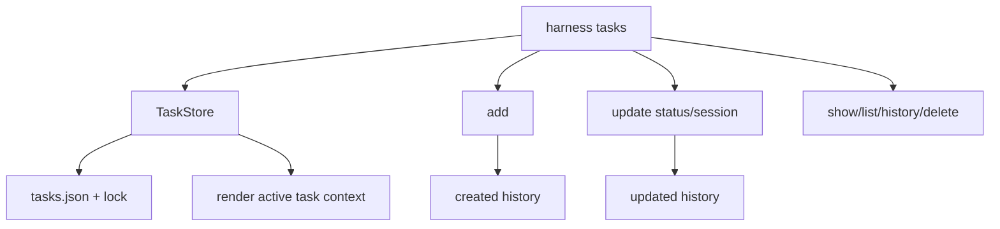

# 039-状态层-Tasks-Ledger Maintenance Commands

## 中文版：任务账本要能增删查改

### 全局作用

参见：[000-总览-Harness-分层架构与连载目录](000-总览-Harness-分层架构与连载目录.md)。本文位于状态层的 Task Ledger 分支。

Task Ledger Maintenance Commands 提供任务创建、更新、查看、历史、删除和过滤列表。它让长程任务脱离单个 session，成为可管理、可注入上下文、可诊断的状态对象。

### 输入 / 输出 / 行为

- 输入：`harness tasks` 命令、task title、description、status、session id。
- 输出：task JSON 或文本列表。
- 行为：
  - add 创建 task，并写入 created history。
  - update 修改 status/session/description，并写入 updated history。
  - show/history/delete/list 提供维护入口。
  - list 支持 status 和 session 过滤。
- 失败模式：task 不存在时报错；非法 status 报错；空 title 报错。

### 实现原理与流程图

TaskStore 使用单个 JSON 文件和锁维护任务账本。每次变更都记录 history，方便后续 handoff、run diagnose 和状态回放。



### 当前实现

| 项 | 状态 |
|---|---|
| 层 | 状态层 |
| 模块 | Tasks |
| 子模块 | Ledger Maintenance Commands |
| 实现状态 | 已实现 |
| 对应提交 | `3789269 Add task ledger maintenance commands` |

- 模块：`harness.tasks.TaskStore`
- CLI：`harness tasks --add/--update/--show/--history/--delete`
- 状态：`todo`、`in_progress`、`done`、`blocked`

### 横向对标

| Harness | 对应实现 | 实现原理 |
|---|---|---|
| Claude Code | task registry、slash commands、subagent handoff | 任务与交互命令、子 agent 和上下文交接绑定。 |
| Codex | agent roles、hooks、state DB、run records | 任务状态服务本地执行、hooks 和历史恢复。 |
| OpenClaw | session routing、cron、ACP control plane | 任务账本可演进为控制面调度对象。 |
| Hermes Agent | kanban workers、cron、state.db | 任务以看板/worker 形式进入调度和复盘。 |

本仓库先实现本地 task ledger，让任务状态可以被 run、handoff 和 context 注入共享。

### 测试例跑法

```bash
PYTHONPATH=src python3 -m pytest tests/test_tasks.py tests/test_cli_smoke.py::test_cli_tasks_create_update_show_and_associate_run -q
```

读者验证点：任务增删查改会更新 tasks.json，并保留 history。

### 后续扩展

- 支持子任务、依赖、优先级和 owner。
- 将 task 与 queued runs 更紧密绑定。
- 为 server/workbench 提供 task API。

## English Version

Task ledger maintenance commands make long-running work manageable outside a
single session. Tasks can be created, updated, listed, inspected, and injected
back into runtime context.
