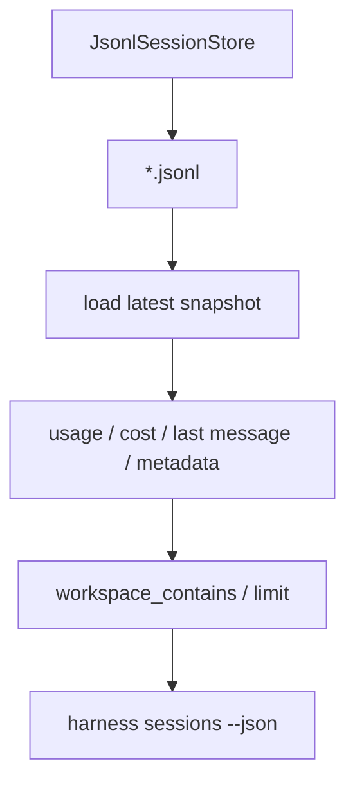

# 040-状态层-Session-Summaries

## 中文版：不用打开全文也能浏览会话

### 全局作用

参见：[000-总览-Harness-分层架构与连载目录](000-总览-Harness-分层架构与连载目录.md)。本文位于状态层的 Session Store 分支。

Session Summaries 为本地 session store 提供列表视图：id、workspace、消息数、usage、cost、最后一条消息和 metadata。它让用户能快速找到要恢复、导出、压缩或生成 handoff 的会话。

### 输入 / 输出 / 行为

- 输入：session dir、可选 workspace contains、limit、JSON。
- 输出：session summary list。
- 行为：
  - 遍历 session JSONL 文件。
  - 加载每个 session 的最新 snapshot。
  - 提取 usage、cost、last_role、last_content、metadata。
  - 支持 workspace substring 过滤和 limit。
- 失败模式：空目录返回空列表；损坏 session JSONL 会暴露解析错误。

### 实现原理与流程图

Session summary 是 session store 的派生视图，不改变原始 snapshot。CLI 默认打印 id，JSON 模式输出完整摘要。



### 当前实现

| 项 | 状态 |
|---|---|
| 层 | 状态层 |
| 模块 | Session |
| 子模块 | Summaries |
| 实现状态 | 已实现 |
| 对应提交 | `3b48c9f Add session summaries` |

- 模块：`JsonlSessionStore.summaries`
- CLI：`harness sessions --workspace-contains ... --limit ... --json`

### 横向对标

| Harness | 对应实现 | 实现原理 |
|---|---|---|
| Claude Code | session memory、remote/direct sessions、SDK streams | 会话列表需要服务恢复、远端会话和 IDE/SDK 流。 |
| Codex | history manager、state DB、desktop app | session summary 是桌面和 CLI 恢复体验的基础。 |
| OpenClaw | session routing、messaging channels | summary 需要包含通道、节点和路由信息。 |
| Hermes Agent | state.db、FTS5 session search | session summary 可进一步演进为全文检索和轨迹检索。 |

本仓库先用 JSONL 最新 snapshot 提供列表视图，保持本地文件可读。未来 server 阶段会迁移到可查询索引。

### 测试例跑法

```bash
PYTHONPATH=src python3 -m pytest tests/test_session_context.py::test_session_store_lists_summaries_and_filters_by_workspace tests/test_cli_smoke.py::test_cli_can_resume_existing_session -q
```

读者验证点：summary 会显示最新 session 的 usage、cost 和最后消息，并能按 workspace 过滤。

### 后续扩展

- 增加按更新时间排序、分页和搜索。
- 将 summary 与 trace session summary 合并显示。
- 增加 session tag 和 task id 过滤。

## English Version

Session summaries provide a compact view over local session snapshots so users
can find sessions to resume, export, compact, or hand off without opening full
history.
