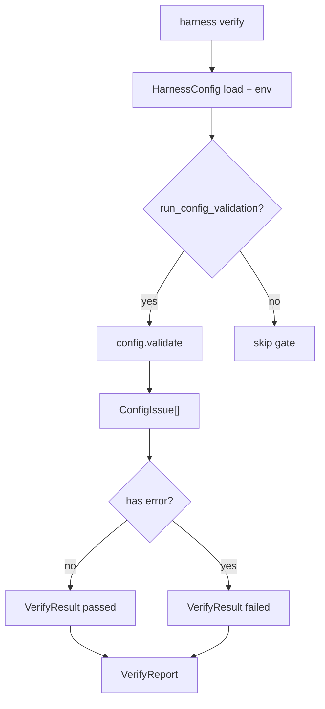

# 041-验证层-Verify-Config Validation Gate

## 中文版：把配置校验纳入本地验证门禁

### 全局作用

参见：[000-总览-Harness-分层架构与连载目录](000-总览-Harness-分层架构与连载目录.md)。本文位于验证层和治理层交界处。

Config Validation Gate 将 `HarnessConfig.validate()` 纳入 `harness verify`，让配置错误在测试、编译、smoke 之前暴露。Harness 的执行能力越多，配置越不能只靠运行时撞错；权限、工具 profile、预算、模型 endpoint 这些都应该先过门禁。

### 输入 / 输出 / 行为

- 输入：合并后的 config、`harness verify` 参数。
- 输出：verify report 中的 `config_validation` 结果。
- 行为：
  - 默认执行 config validation。
  - 存在 error 时 gate 失败。
  - warn 会输出但不阻断。
  - `--skip-config-validation` 可显式跳过。
- 失败模式：非法权限、非法工具 profile、负数限制、allow/deny 冲突会失败。

### 实现原理与流程图

Verify runner 把配置校验作为独立 gate，与 pytest、compile、mock smoke、live smoke 并列。这样配置错误不会被隐藏在更后面的运行失败里。



### 当前实现

| 项 | 状态 |
|---|---|
| 层 | 验证层 / 治理层 |
| 模块 | Verify |
| 子模块 | Config Validation Gate |
| 实现状态 | 已实现 |
| 对应提交 | `dbbdba7 Add config validation to verify` |

- 模块：`harness.verify.run_verify`、`_run_config_validation`
- CLI：`harness verify`、`harness verify --skip-config-validation`

### 横向对标

| Harness | 对应实现 | 实现原理 |
|---|---|---|
| Claude Code | doctor、permission modes、MCP config scopes | doctor 会检查配置、权限和运行环境，避免错误配置进入工具执行。 |
| Codex | doctor、config layering、permission profile | 多来源配置合并后需要统一验证，保证 CLI/桌面/IDE 行为一致。 |
| OpenClaw | gateway health、auth profiles、agent bindings | 多节点配置要在路由和授权前被检查。 |
| Hermes Agent | doctor、model providers、toolsets | provider、toolset、sandbox 和状态目录都进入诊断路径。 |

本仓库把配置校验放进 verify，是为了形成本地工程门禁；生产阶段可扩展为 server 启动检查和 workspace policy 检查。

### 测试例跑法

```bash
PYTHONPATH=src python3 -m pytest tests/test_verify.py::test_verify_fails_invalid_config tests/test_verify.py::test_verify_can_skip_config_validation tests/test_verify.py::test_cli_verify_fails_invalid_config -q
```

读者验证点：非法配置会让 verify 非零退出；显式 skip 后不会运行该 gate。

### 后续扩展

- 输出配置来源：默认值、文件、环境变量、CLI。
- 校验 sandbox runner 和 workspace scope。
- 支持 machine-readable schema。

## English Version

Config validation gate makes configuration correctness part of local
verification, before tests, compile, and smoke runs.
