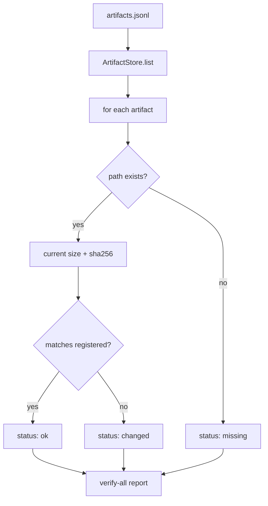

# 042-产物层-Artifacts-Batch Verification

## 中文版：一次检查所有产物是否还可信

### 全局作用

参见：[000-总览-Harness-分层架构与连载目录](000-总览-Harness-分层架构与连载目录.md)。本文位于产物层的 Artifact Verification 分支。

Batch Verification 让 artifact index 中的所有产物都能被一次性校验，判断文件是否存在、大小是否一致、sha256 是否匹配。它是 checkpoint manifest、trace 派生产物、bundle 和后续报告的完整性检查基础。

### 输入 / 输出 / 行为

- 输入：artifact index。
- 输出：每个 artifact 的状态：`ok`、`changed`、`missing`。
- 行为：
  - 遍历 `ArtifactStore.list()`。
  - 对每个 path 重新读取 size 和 sha256。
  - 与登记时的 size/sha256 对比。
  - CLI 支持文本和 JSON 输出。
- 失败模式：artifact index 损坏会失败；单个文件缺失不会中断批量检查，而是返回 `missing`。

### 实现原理与流程图

artifact 登记的是“当时的事实”，batch verify 重新采样当前文件系统事实并比较。这个过程不修改 index。



### 当前实现

| 项 | 状态 |
|---|---|
| 层 | 产物层 |
| 模块 | Artifacts |
| 子模块 | Batch Verification |
| 实现状态 | 已实现 |
| 对应提交 | `b218d33 Add artifact batch verification` |

- 模块：`harness.artifacts.ArtifactStore.verify_all`
- CLI：`harness artifacts --verify-all --json`

### 横向对标

| Harness | 对应实现 | 实现原理 |
|---|---|---|
| Claude Code | VCR fixtures、analytics artifacts | 回放样本和诊断产物需要确认未被意外改动。 |
| Codex | rollout trace、state DB、trace reducer outputs | 批量校验帮助确认评测输入和压缩轨迹仍可信。 |
| OpenClaw | gateway logs、diagnostic artifacts | 多节点产物要保留来源和完整性证据。 |
| Hermes Agent | trajectories、batch outputs | 批量 runner 产生大量轨迹，必须能批量检查。 |

本仓库先用本地文件 hash 完成最小完整性检查，后续会接入 run/task/session 来源字段。

### 测试例跑法

```bash
PYTHONPATH=src python3 -m pytest tests/test_artifacts_audit.py::test_artifact_store_verify_all_reports_changed_and_missing tests/test_artifacts_audit.py::test_cli_artifacts_and_audit_smoke -q
```

读者验证点：已修改文件显示 `changed`，已删除文件显示 `missing`，未变化文件显示 `ok`。

### 后续扩展

- 支持远端对象存储校验。
- 支持 artifact retention 与清理策略。
- 将 verify-all 结果登记为诊断 artifact。

## English Version

Artifact batch verification checks every registered artifact for existence,
size, and sha256 integrity without mutating the artifact index.
