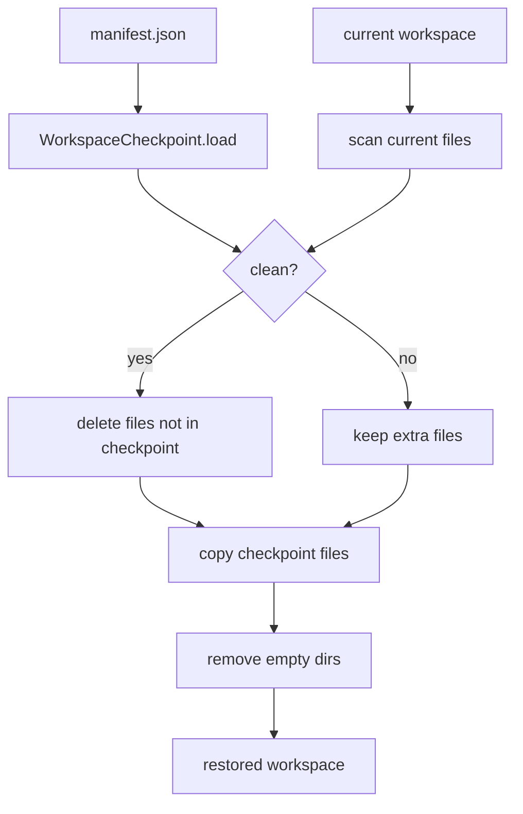

# 043-执行层-Checkpoint-Clean Restore

## 中文版：恢复时删除 checkpoint 之外的多余文件

### 全局作用

参见：[000-总览-Harness-分层架构与连载目录](000-总览-Harness-分层架构与连载目录.md)。本文位于执行与安全基础设施层的 Checkpoint 分支。

Clean Restore 让 workspace 恢复到 checkpoint 时不仅覆盖已有文件，还删除 checkpoint 中不存在的额外文件。对失败回滚来说，这能避免失败 run 产生的临时文件残留。

### 输入 / 输出 / 行为

- 输入：checkpoint manifest、workspace、`clean=True`。
- 输出：恢复后的 workspace 和 checkpoint 信息。
- 行为：
  - 加载 checkpoint manifest。
  - 扫描当前 workspace。
  - clean 模式下删除不在 checkpoint manifest 里的文件。
  - 复制 checkpoint 文件覆盖当前文件。
  - 删除空目录。
- 失败模式：manifest 不存在或 snapshot 文件缺失时报错；workspace 会自动创建。

### 实现原理与流程图

普通 restore 只保证 checkpoint 文件存在；clean restore 额外保证 workspace 文件集合不超过 checkpoint 文件集合。



### 当前实现

| 项 | 状态 |
|---|---|
| 层 | 执行与安全基础设施 |
| 模块 | Checkpoint |
| 子模块 | Clean Restore |
| 实现状态 | 已实现 |
| 对应提交 | `9c5ed7a Add clean checkpoint restore` |

- 模块：`harness.checkpoint.WorkspaceCheckpoint.restore(clean=True)`
- CLI：`harness checkpoint --restore <manifest> --clean`
- Run 联动：`harness run --restore-checkpoint-on-failure` 使用 clean restore。

### 横向对标

| Harness | 对应实现 | 实现原理 |
|---|---|---|
| Claude Code | worktree isolation、file edit rollback | 倾向通过独立 worktree 和编辑记录限制失败影响面。 |
| Codex | platform sandbox、exec-server、rollback state | 恢复需要和 sandbox、approval、state DB 对齐。 |
| OpenClaw | Docker / SSH / OpenShell sandbox | 容器或远端 workspace 可通过快照/挂载恢复干净状态。 |
| Hermes Agent | checkpoint、trajectory、batch runner | checkpoint 用于失败恢复和批量运行隔离。 |

本仓库用文件级 checkpoint 实现 clean restore，不依赖 git 或容器，适合本地 harness 的最小可恢复模型。

### 测试例跑法

```bash
PYTHONPATH=src python3 -m pytest tests/test_checkpoint.py::test_workspace_checkpoint_clean_restore_removes_extra_files tests/test_checkpoint.py::test_cli_checkpoint_clean_restore -q
```

读者验证点：restore 后 checkpoint 外新增文件被删除，checkpoint 内文件被恢复。

### 后续扩展

- 增加 restore 前 diff 预览和确认。
- 支持 ignore 规则和大文件策略。
- 将 clean restore 结果写入 trace/audit。

## English Version

Clean restore removes files not present in the checkpoint manifest, making
failed-run rollback return the workspace to the checkpoint file set.
