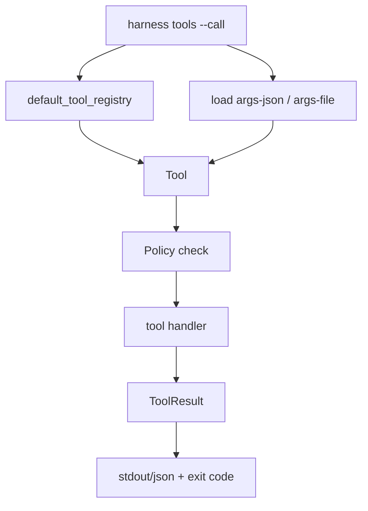

# 044-工具层-Tools-CLI Invocation

## 中文版：工具可以脱离模型单独验证

### 全局作用

参见：[000-总览-Harness-分层架构与连载目录](000-总览-Harness-分层架构与连载目录.md)。本文位于工具层和体验层交界处。

CLI Invocation 允许用户直接执行内置工具：`harness tools --call <tool> --args-json ...`。这让工具层可以独立于模型调试，确认参数、权限、workspace guard、sandbox runner 和输出限制是否正确。

### 输入 / 输出 / 行为

- 输入：tool name、JSON 参数、workspace、permission、tool profile、sandbox runner。
- 输出：工具输出，或 JSON 结构 `{name,is_error,output}`。
- 行为：
  - 从当前配置构建 tool registry。
  - 读取 `--args-json` 或 `--args-file`。
  - 应用 Policy。
  - 执行工具并按 `is_error` 设置退出码。
- 失败模式：工具不存在、参数不是 JSON object、权限拒绝、sandbox 缺失都会失败。

### 实现原理与流程图

CLI 使用和 Kernel 同一套 tool registry 与 Policy，因此 CLI smoke 能覆盖模型调用工具前的大部分工具层逻辑。



### 当前实现

| 项 | 状态 |
|---|---|
| 层 | 工具层 / Experience |
| 模块 | Tools |
| 子模块 | CLI Invocation |
| 实现状态 | 已实现 |
| 对应提交 | `d66f6ff Add CLI tool invocation` |

- CLI：`harness tools --call read_file --args-json '{"path":"a.txt"}'`
- 相关模块：`Tool.run`、`Policy`、`Workspace`

### 横向对标

| Harness | 对应实现 | 实现原理 |
|---|---|---|
| Claude Code | slash commands、tool pool、permission modes | 工具能力既被模型调用，也能通过用户命令和权限模式显式控制。 |
| Codex | TUI/CLI、ToolRouter、unified exec | CLI 与 runtime 共享工具路由，方便本地调试。 |
| OpenClaw | CLI、Control UI、plugin registry | 工具可由控制面或消息通道触发，需要统一权限。 |
| Hermes Agent | CLI/TUI、toolsets、tool registry | toolset 可通过 CLI 检查和组合。 |

本仓库优先提供 CLI invocation，是为了让工具层 TDD 不依赖真实模型输出。

### 测试例跑法

```bash
PYTHONPATH=src python3 -m pytest tests/test_cli_smoke.py::test_cli_tools_can_call_tool_with_json_args tests/test_cli_smoke.py::test_cli_tools_call_exits_nonzero_on_policy_error -q
```

读者验证点：合法工具调用成功写/读文件；权限拒绝时退出码非零。

### 后续扩展

- 支持批量 tool call replay。
- 输出 trace/audit 事件。
- 支持 MCP 工具通过同一 CLI 调用。

## English Version

CLI tool invocation lets tools be tested without a model while reusing the same
registry, policy, workspace, and sandbox boundaries as runtime.
