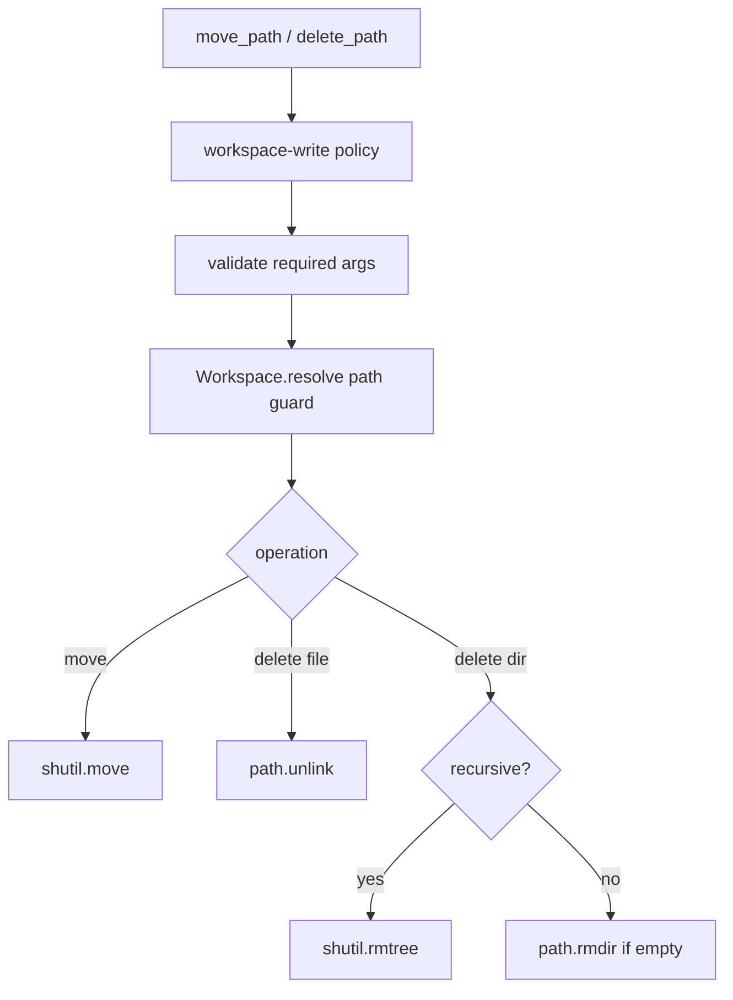

# 045-工具层-Filesystem-Move And Delete Tools

## 中文版：文件不只会写，还要能移动和删除

### 全局作用

参见：[000-总览-Harness-分层架构与连载目录](000-总览-Harness-分层架构与连载目录.md)。本文位于工具层的 Filesystem Tools 分支。

Move 和 Delete 是 coding agent 的基础文件操作。没有它们，模型只能新增或覆盖文件，无法完成重命名、整理目录、删除生成物等真实开发任务。

### 输入 / 输出 / 行为

- 输入：`move_path` 的 source/destination，`delete_path` 的 path/recursive。
- 输出：操作结果文本。
- 行为：
  - 所有路径都通过 `Workspace.resolve` 做 path guard。
  - move 要求 source 存在、destination 不存在。
  - delete 文件直接删除；目录需空或显式 recursive。
  - 两个工具都要求 `workspace-write` 权限。
- 失败模式：路径逃逸、source 不存在、destination 已存在、非空目录未 recursive 都会失败。

### 实现原理与流程图

工具只处理 workspace 内的文件系统变更；权限和路径边界在 handler 前后协同完成。



### 当前实现

| 项 | 状态 |
|---|---|
| 层 | 工具层 |
| 模块 | Filesystem |
| 子模块 | Move And Delete Tools |
| 实现状态 | 已实现 |
| 对应提交 | `f021025 Add workspace move and delete tools` |

- 工具：`move_path`、`delete_path`
- 权限：`workspace-write`
- Profile：`coding`

### 横向对标

| Harness | 对应实现 | 实现原理 |
|---|---|---|
| Claude Code | file edit、Bash / PowerShell、permission hooks | 文件变更既可走专用工具，也可走 shell，但都受权限控制。 |
| Codex | unified exec、file tools、approval cache | 文件工具与执行工具共享 workspace 和 approval 边界。 |
| OpenClaw | filesystem bridge、exec approval | 文件操作可能跨 sandbox/远端节点，需要 bridge 保证路径边界。 |
| Hermes Agent | computer use、browser、local/Docker/SSH sandbox | 文件操作由不同 sandbox 后端承载，仍需统一工具语义。 |

本仓库将 move/delete 做成内置文件工具，而不是要求模型用 shell 完成，是为了降低风险并让 path guard 更清晰。

### 测试例跑法

```bash
PYTHONPATH=src python3 -m pytest tests/test_tools_workspace.py::test_move_path_moves_files_inside_workspace tests/test_tools_workspace.py::test_delete_path_deletes_file_and_recursive_directory tests/test_tools_workspace.py::test_delete_path_refuses_nonempty_directory_without_recursive -q
```

读者验证点：文件可移动、文件和递归目录可删除，非空目录默认拒绝。

### 后续扩展

- 删除前登记 artifact 或 checkpoint。
- 支持 trash/recycle 模式。
- 将文件变更事件写入 trace。

## English Version

Move and delete tools give local coding agents safe workspace-scoped file
organization primitives without forcing the model to use shell commands.
