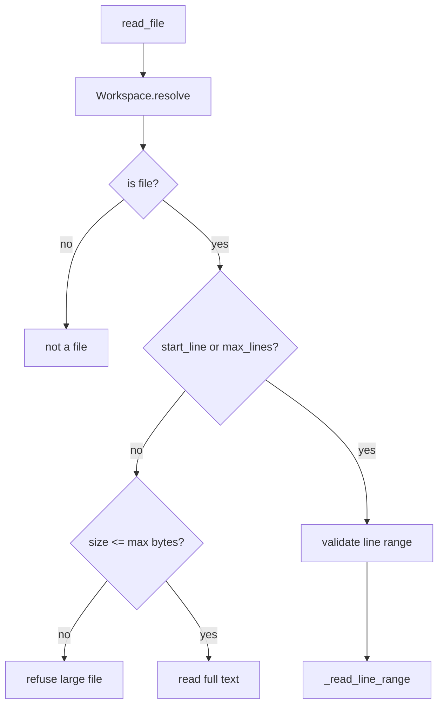

# 046-工具层-Filesystem-Ranged File Reads

## 中文版：大文件要能按行读取

### 全局作用

参见：[000-总览-Harness-分层架构与连载目录](000-总览-Harness-分层架构与连载目录.md)。本文位于工具层的 Filesystem Read 分支。

Ranged File Reads 让 `read_file` 支持 `start_line` 和 `max_lines`，用于读取大文件片段。Agent 不应该为了看一个函数把整个超大文件塞进上下文。

### 输入 / 输出 / 行为

- 输入：path、可选 `start_line`、`max_lines`。
- 输出：选中行范围的 UTF-8 文本。
- 行为：
  - path 必须在 workspace 内。
  - 文件必须是文本文件。
  - 未指定 range 时受 `max_file_read_bytes` 限制。
  - 指定 range 时允许从大文件中读取片段。
- 失败模式：start_line < 1、max_lines < 1、二进制文件、路径不是文件都会失败。

### 实现原理与流程图

读取前先做路径和类型检查；range 模式逐行扫描并截取，避免一次性把大文件放进模型上下文。



### 当前实现

| 项 | 状态 |
|---|---|
| 层 | 工具层 |
| 模块 | Filesystem |
| 子模块 | Ranged File Reads |
| 实现状态 | 已实现 |
| 对应提交 | `f333efa Support ranged file reads` |

- 工具：`read_file`
- 参数：`start_line`、`max_lines`
- 相关限制：`max_file_read_bytes`

### 横向对标

| Harness | 对应实现 | 实现原理 |
|---|---|---|
| Claude Code | file read、LSP/code intelligence、context compact | 大文件读取会与代码智能和上下文预算协调。 |
| Codex | file search、history manager、ToolRouter | 读取片段减少 token 压力，并便于 IDE/CLI 定位。 |
| OpenClaw | filesystem bridge、context engine | 远端文件读取需要片段化，避免通道传输过大。 |
| Hermes Agent | FTS5 session search、business connectors、file tools | 文件和知识检索都倾向返回小片段上下文。 |

本仓库先做行范围读取，为后续 grep/LSP/context loader 留出统一片段接口。

### 测试例跑法

```bash
PYTHONPATH=src python3 -m pytest tests/test_tools_workspace.py::test_read_file_can_read_line_ranges_from_large_files tests/test_tools_workspace.py::test_read_file_rejects_invalid_line_ranges -q
```

读者验证点：超出 size limit 的大文件可按行读取；非法行范围会失败。

### 后续扩展

- 输出行号。
- 支持 byte range。
- 与 grep 结果联动读取上下文片段。

## English Version

Ranged file reads let agents inspect large text files by line range instead of
loading entire files into context.
