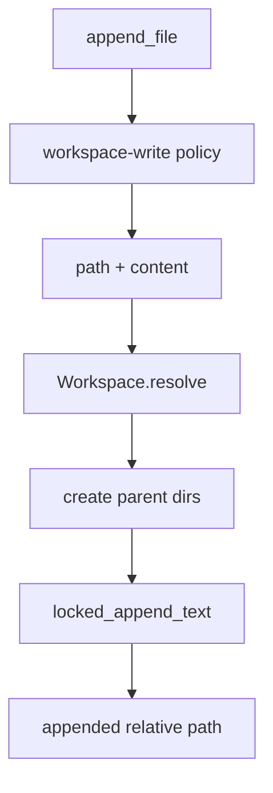

# 047-工具层-Filesystem-Append File Tool

## 中文版：追加写入是日志和文档的基础动作

### 全局作用

参见：[000-总览-Harness-分层架构与连载目录](000-总览-Harness-分层架构与连载目录.md)。本文位于工具层的 Filesystem Write 分支。

Append File Tool 提供 `append_file`，用于在 workspace 内追加文本。它适合日志、任务记录、Markdown 列表、渐进式报告等场景，避免每次都读全文件再覆盖写入。

### 输入 / 输出 / 行为

- 输入：path、content。
- 输出：`appended <path>`。
- 行为：
  - path 经 workspace guard。
  - 父目录不存在时自动创建。
  - 使用 locked append，降低并发追加互相覆盖风险。
  - 需要 `workspace-write` 权限。
- 失败模式：路径逃逸、权限不足、参数缺失会失败。

### 实现原理与流程图

append 和 write 分开，是为了表达不同意图：write 是替换文件内容，append 是在文件末尾追加，并且使用追加锁保护。



### 当前实现

| 项 | 状态 |
|---|---|
| 层 | 工具层 |
| 模块 | Filesystem |
| 子模块 | Append File Tool |
| 实现状态 | 已实现 |
| 对应提交 | `c7f51bd Add append file tool` |

- 工具：`append_file`
- 权限：`workspace-write`
- 并发：使用 `locked_append_text`

### 横向对标

| Harness | 对应实现 | 实现原理 |
|---|---|---|
| Claude Code | file edit、memory markdown、hooks | 追加适合日志、memory 和 hook 输出，但需要权限控制。 |
| Codex | unified exec、memories、state DB | 文件追加可作为轻量状态写入，也可迁移到结构化状态库。 |
| OpenClaw | Markdown memory、diagnostic events | 追加型文本状态适合 memory 和诊断日志。 |
| Hermes Agent | skills、state.db、logs | 生产级会把部分追加写转入数据库或轨迹系统。 |

本仓库保留 append_file，是为了让模型用更低风险的方式维护增量文本。

### 测试例跑法

```bash
PYTHONPATH=src python3 -m pytest tests/test_tools_workspace.py::test_append_file_appends_to_existing_and_new_files tests/test_tools_workspace.py::test_append_file_serializes_concurrent_appends tests/test_tools_workspace.py::test_append_file_requires_workspace_write_permission -q
```

读者验证点：可追加已有文件和新文件；并发追加不会丢行；read-only 权限拒绝。

### 后续扩展

- 支持 append with newline 选项。
- 写入 trace 文件变更事件。
- 支持 append 前后 hash 校验。

## English Version

Append file provides a workspace-scoped, locked text append primitive for logs,
Markdown state, and incremental reports.
