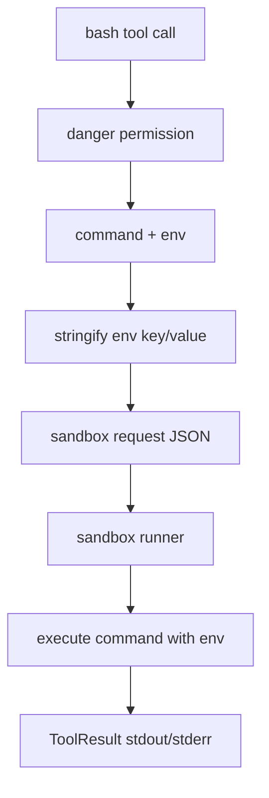

# 048-工具层-Execution-Bash Environment Variables

## 中文版：执行命令时显式传入环境变量

### 全局作用

参见：[000-总览-Harness-分层架构与连载目录](000-总览-Harness-分层架构与连载目录.md)。本文位于工具层的 Execution Tools 分支。

Bash Environment Variables 让 `bash` 工具支持结构化 `env` 参数。Agent 可以为单次命令传入必要环境变量，而不是污染整个 harness 进程环境。

### 输入 / 输出 / 行为

- 输入：command、可选 env、timeout、cwd。
- 输出：sandbox runner 返回的 stdout/stderr。
- 行为：
  - `env` 必须是 object。
  - key/value 转为 string。
  - env 随 sandbox request 传给 runner。
  - bash 必须有 sandbox runner，否则 fail closed。
- 失败模式：env 类型错误、权限不足、runner 缺失、命令非零退出都会失败。

### 实现原理与流程图

bash 工具本身不直接执行 shell，而是把 command、cwd、workspace_root、env、timeout 打包给 sandbox runner。env 是这份 request 的一部分。



### 当前实现

| 项 | 状态 |
|---|---|
| 层 | 工具层 / 执行与安全基础设施 |
| 模块 | Execution |
| 子模块 | Bash Environment Variables |
| 实现状态 | 已实现 |
| 对应提交 | `f12bbec Support bash environment variables` |

- 工具：`bash`
- 参数：`env`
- 安全边界：必须经 `sandbox_runner`

### 横向对标

| Harness | 对应实现 | 实现原理 |
|---|---|---|
| Claude Code | Bash / PowerShell、permission hooks、secure storage | 环境变量通常与 secrets、安全存储和命令权限绑定。 |
| Codex | unified exec、exec-server、network proxy | 执行环境由 exec server 控制，env 需要被显式传递和审计。 |
| OpenClaw | Docker / SSH / OpenShell sandbox、secrets | 远端执行时 env 与 secrets 注入必须分层治理。 |
| Hermes Agent | local / Docker / SSH / Modal sandbox、approval | 多后端 sandbox 都需要统一 env request 语义。 |

本仓库支持普通 env 参数，但 secrets 管理还未展开；后续会把敏感变量接入 secure storage 和 audit。

### 测试例跑法

```bash
PYTHONPATH=src python3 -m pytest tests/test_tools_workspace.py::test_bash_accepts_structured_environment_variables -q
```

读者验证点：bash runner 能读取传入 env，且 env 不需要写入全局进程环境。

### 后续扩展

- 增加 secret reference 而不是明文 env。
- 将 env keys 写入 audit，敏感值脱敏。
- 支持 profile 级 env allowlist。

## English Version

Bash environment variables are passed as structured request data to the sandbox
runner, keeping command-specific env separate from the harness process.
