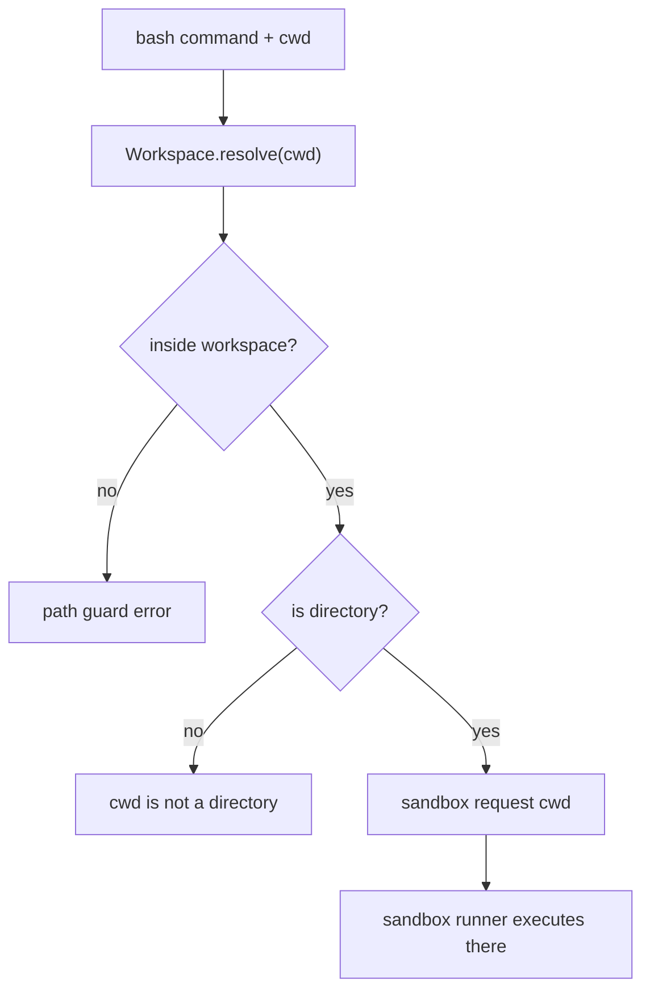

# 049-工具层-Execution-Bash Working Directory

## 中文版：命令可以在工作区子目录里运行

### 全局作用

参见：[000-总览-Harness-分层架构与连载目录](000-总览-Harness-分层架构与连载目录.md)。本文位于工具层的 Execution Tools 分支。

Bash Working Directory 让 `bash` 支持 `cwd` 参数。开发任务经常需要在子项目目录运行测试、构建或脚本；cwd 支持让命令更贴近真实项目结构，同时仍受 workspace guard 约束。

### 输入 / 输出 / 行为

- 输入：command、可选 cwd。
- 输出：命令输出。
- 行为：
  - cwd 默认为 workspace 根。
  - cwd 经 `Workspace.resolve`，不能逃出 workspace。
  - cwd 必须是目录。
  - cwd 随 sandbox request 传给 runner。
- 失败模式：cwd 不存在、不是目录、逃出 workspace、runner 缺失、命令失败都会返回错误。

### 实现原理与流程图

cwd 是执行工具的能力参数，但安全边界仍由 Workspace.resolve 和 sandbox runner 双重约束。



### 当前实现

| 项 | 状态 |
|---|---|
| 层 | 工具层 / 执行与安全基础设施 |
| 模块 | Execution |
| 子模块 | Bash Working Directory |
| 实现状态 | 已实现 |
| 对应提交 | `717c020 Support bash working directories` |

- 工具：`bash`
- 参数：`cwd`
- 安全边界：workspace path guard + sandbox runner。

### 横向对标

| Harness | 对应实现 | 实现原理 |
|---|---|---|
| Claude Code | Bash / PowerShell、worktree isolation | 命令执行目录与项目根、worktree 和权限模式绑定。 |
| Codex | unified exec、PTY、exec-server | cwd 是 exec request 的核心字段，由 exec server 验证。 |
| OpenClaw | SSH / Docker / OpenShell sandbox | 远端 cwd 需要在目标节点上校验。 |
| Hermes Agent | local / Docker / SSH sandbox、computer use | 多后端执行统一 cwd 语义，但各自实现路径隔离。 |

本仓库让 cwd 只允许 workspace 内目录，符合 Phase 1 轻量工具级沙箱策略。

### 测试例跑法

```bash
PYTHONPATH=src python3 -m pytest tests/test_tools_workspace.py::test_bash_can_run_from_workspace_subdirectory tests/test_tools_workspace.py::test_bash_cwd_stays_inside_workspace -q
```

读者验证点：命令能在子目录写文件；`cwd=..` 会被拒绝。

### 后续扩展

- 支持 per-tool cwd audit。
- 支持 run-level default cwd。
- 与 task/subproject metadata 自动联动。

## English Version

Bash working directory support lets commands run from workspace subdirectories
while preserving workspace path guards and sandbox execution.
