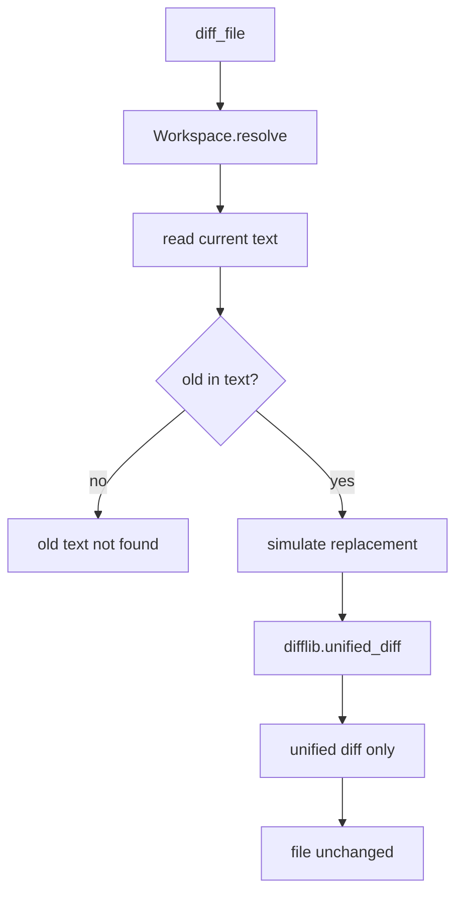

# 050-工具层-Filesystem-Diff Preview Tool

## 中文版：编辑前先看补丁

### 全局作用

参见：[000-总览-Harness-分层架构与连载目录](000-总览-Harness-分层架构与连载目录.md)。本文位于工具层的 Filesystem Edit 分支。

Diff Preview Tool 提供 `diff_file`，用 `old`/`new` 生成 unified diff，但不修改文件。它给模型和用户一个“先预览再编辑”的低风险路径，也为审批和测试提供可读变更摘要。

### 输入 / 输出 / 行为

- 输入：path、old、new、可选 replace_all。
- 输出：unified diff 文本。
- 行为：
  - path 经 workspace guard。
  - 文件按 UTF-8 读取。
  - old 不存在时返回错误。
  - replace_all=false 时只预览第一次替换。
  - 不写入文件。
- 失败模式：路径逃逸、文件不存在、old text not found、二进制/编码错误会失败。

### 实现原理与流程图

`diff_file` 和 `edit_file` 使用相同替换语义，但前者只生成 diff，后者才落盘。这样测试能保证预览和实际编辑一致。



### 当前实现

| 项 | 状态 |
|---|---|
| 层 | 工具层 |
| 模块 | Filesystem |
| 子模块 | Diff Preview Tool |
| 实现状态 | 已实现 |
| 对应提交 | `f590f1b Add file diff preview tool` |

- 工具：`diff_file`
- 相关工具：`edit_file`
- Profile：`safe` 与 `coding` 都包含 `diff_file`

### 横向对标

| Harness | 对应实现 | 实现原理 |
|---|---|---|
| Claude Code | file edit、permission hooks、worktree isolation | 编辑前后的 diff 是用户信任和审批的重要材料。 |
| Codex | file tools、approval cache、rollout trace | diff preview 可进入 approval 和 trace，便于复盘。 |
| OpenClaw | filesystem bridge、exec approval | 跨节点编辑更需要先预览补丁。 |
| Hermes Agent | checkpoint、approval、trajectory | diff 与 checkpoint/trajectory 结合可支持回滚和审计。 |

本仓库把 diff_file 放进 safe profile，让只读探索 agent 也能提出补丁，而不直接修改文件。

### 测试例跑法

```bash
PYTHONPATH=src python3 -m pytest tests/test_tools_workspace.py::test_diff_file_previews_replacement_without_modifying_file tests/test_tools_workspace.py::test_diff_file_can_preview_all_replacements_when_requested tests/test_tools_workspace.py::test_diff_file_reports_missing_old_text -q
```

读者验证点：diff 输出包含预期修改，原文件内容不变；old 不存在时报错。

### 后续扩展

- 支持多文件 diff。
- 将 diff preview 与 approval flow 绑定。
- 支持 patch apply 工具。

## English Version

Diff preview generates unified diffs using the same replacement semantics as
edit_file, but never writes the file.
